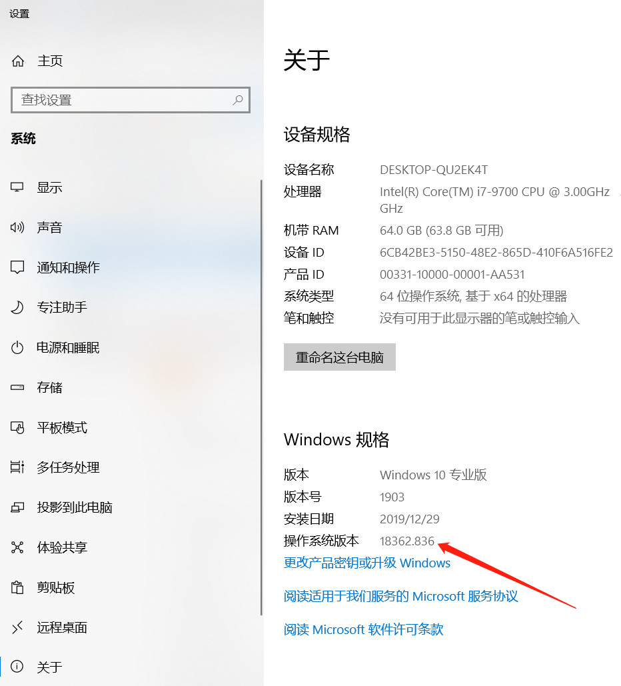
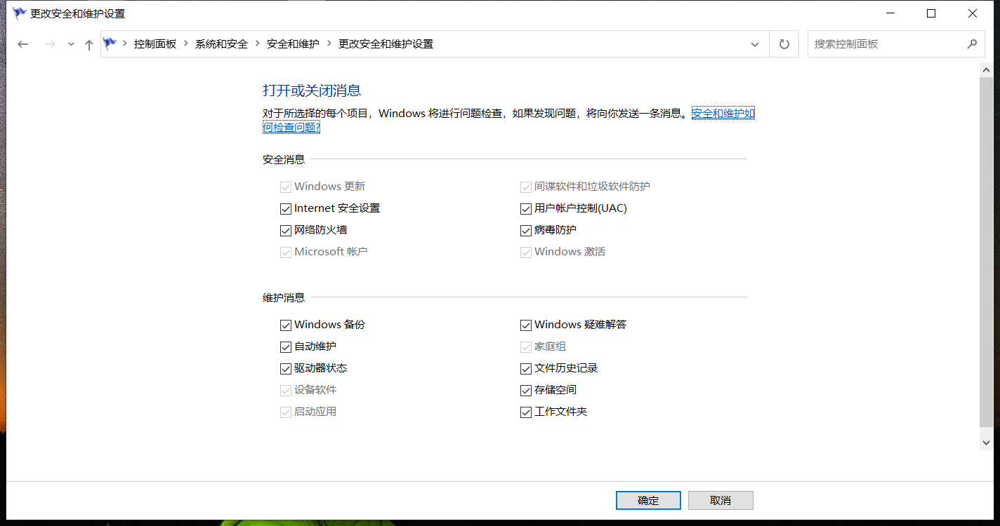
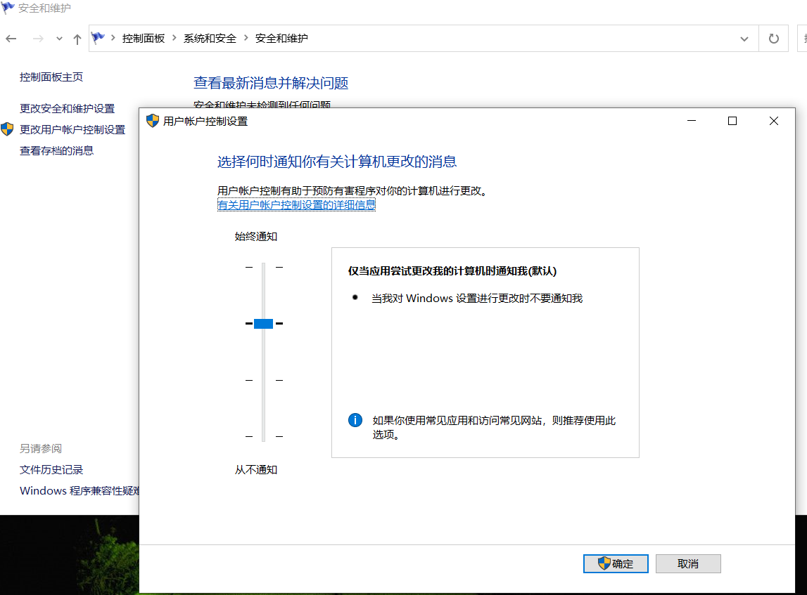

# 
 Windows环境配置

## CPU cores & logical Processors  
reference：  
https://blog.csdn.net/u010250863/article/details/79965465  
Cmd: wmic  
cpu get NumberOfCores  
cpu get NumberOfLogicalProcessors  

## adobe installation  

https://acrobat.adobe.com/cn/zh-Hans/acrobat/pdf-reader.html  

## 查看windows版本
开始->设置->Windows规格：

   

   

当应用程序启动时出现确定对话框时，如果想去掉该对话框，可以修改以下设置：  
   
