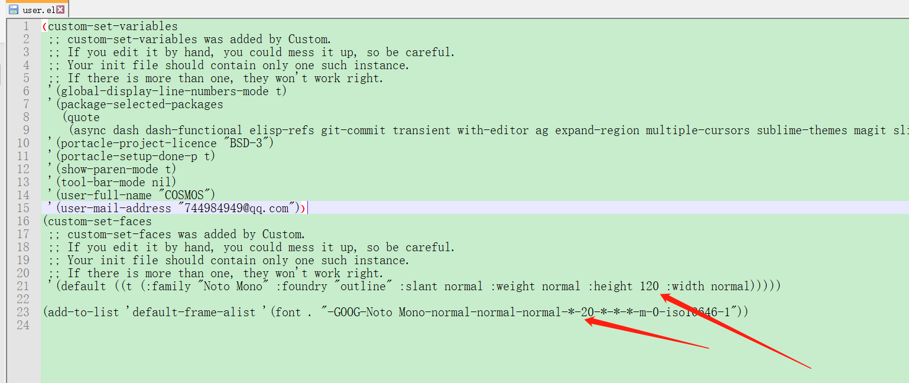

# 
 Deployment Manual for Workstation

## Common Lisp

### 开发环境安装  
https://portacle.github.io/  

### 开发工具设置

#### windows

   
Repl = read, evaluate, print, loop  
C-c C-k: Compile file   
C-c C-c: Compile selected code  
C-x C-s: save the source file  
C-x C-c: exit portacle IDE  

C-x 1: maximize current buffer  
C-x 1 C-x 2: duplicate current buffer vertically  
C-x 1 C-x 3: duplicate current buffer horizontally  

M-x : miniBuffer  
M-x, paredit-mode  
M-x, enable-paredit-mode  

   

Use mouse click left to switch to previous buffer  
Use mouse click right to switch to next buffer  

Use Tool bar menu to change buffers:  

   

字体设置：  
打开D:\Program Files\portacle\config\user.el加入以下代码：  
(custom-set-faces  
 ;; custom-set-faces was added by Custom.  
 ;; If you edit it by hand, you could mess it up, so be careful.  
 ;; Your init file should contain only one such instance.  
 ;; If there is more than one, they won't work right.  
 '(default ((t (:family "Noto Mono" :foundry "outline" :slant normal :weight normal :height 120 :width   normal)))))  

(add-to-list 'default-frame-alist '(font . "-GOOG-Noto Mono-normal-normal-normal-*-20-*-*-*-m-0-iso10646-1"))  
如图所示：  

   