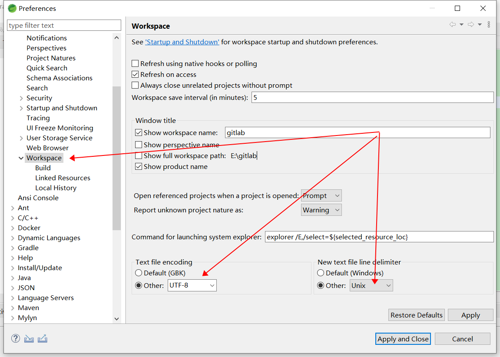
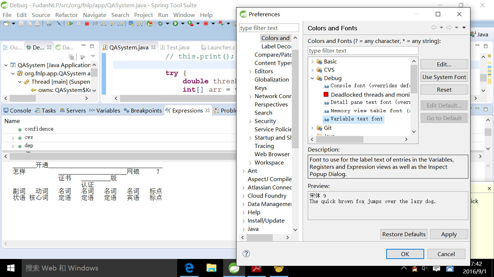
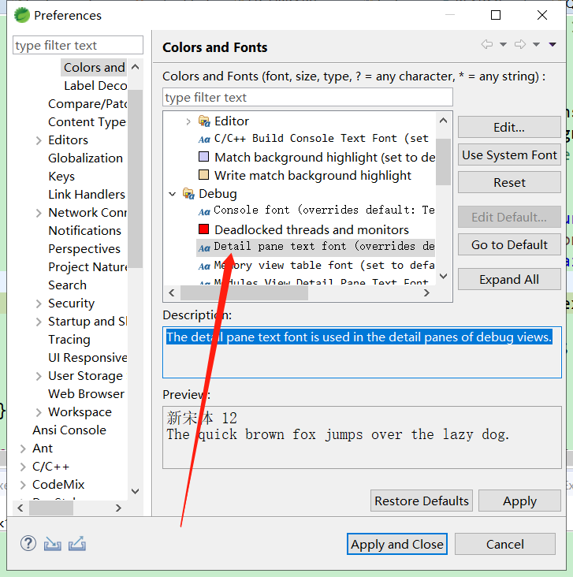
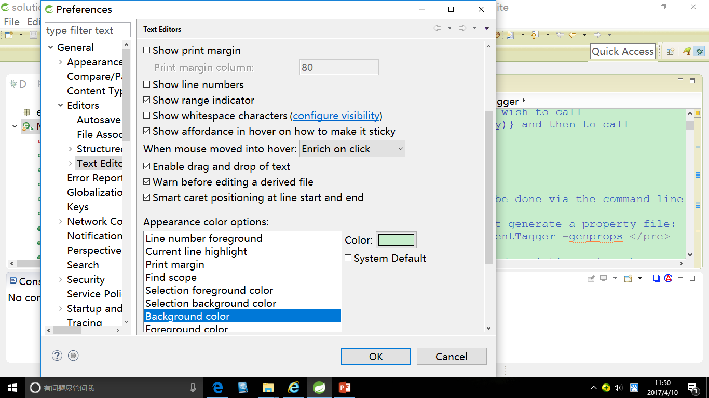
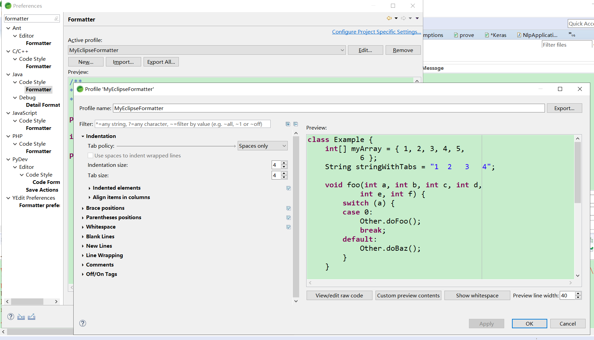
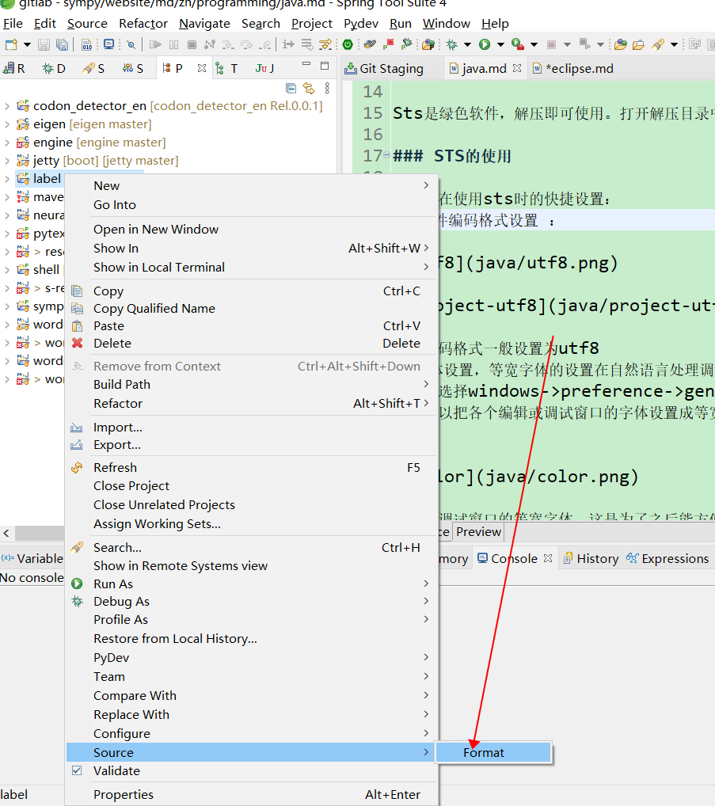
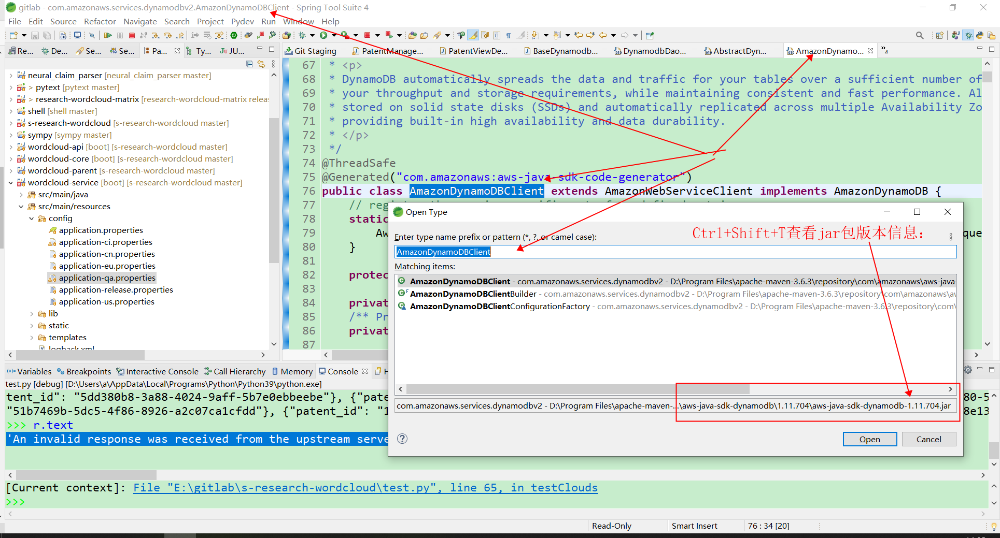
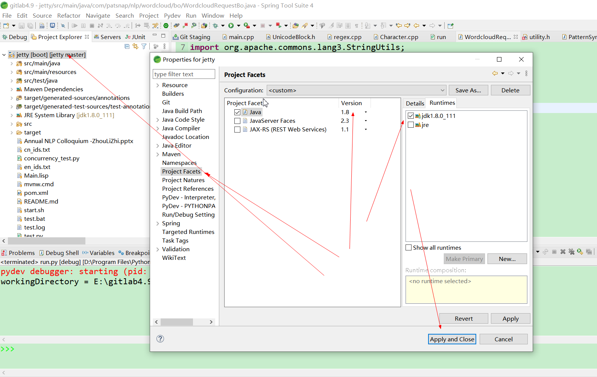
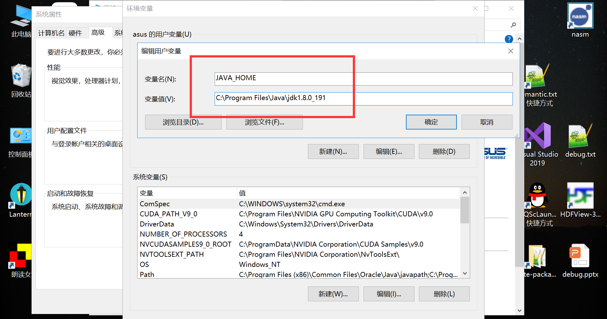
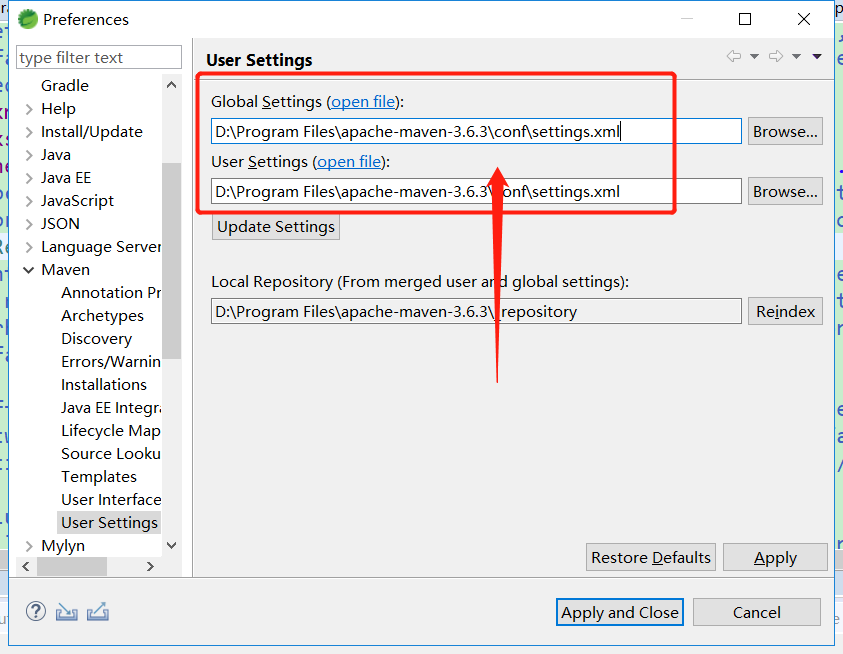

# 
 Deployment Manual for Java

## STS（Eclipse）的安装
Eclipse是JavaWeb开发最常用的工具，下面详细介绍一下如何下载安装Spring Tool Suite(Eclipse的一种)。  
Spring Tool Suite开发工具是spring官网推出的一款方便利用spring一系列框架的软件，界面风格和eclipse，myeclipse相同，它能方便集成各个主流  编程语言（python, java, C/C++, PHP,甚至汇编语言）于一身，大大提高编码效率，所谓工欲善其事，必先利其器！  
那么让我们来看看如何安装sts这款软件  

### STS的下载
输入网址：
https://spring.io/tools

### STS的安装

Sts是绿色软件，解压即可使用。打开解压目录中的STS.exe即可。

### STS的使用

以下是在使用sts时的快捷设置：  
1，文件编码格式设置 ：  

   

   

文件编码格式一般设置为utf8  
2,字体设置，等宽字体的设置在自然语言处理调试中很重要，等宽字体可以方便打印句法树的刻画。  
如图：选择windows->preference->genera->appearance->Color and Fonts  
在此可以把各个编辑或调试窗口的字体设置成等宽字体。  

   

以下是调试窗口的等宽字体，这是为了之后能方便打印句法树，对自然语言进行分析。

   

   

   

   

以下可以设置编辑窗口的字体颜色，我们调整到护眼绿色：  
R=199,G=237,B=204  

   

Tab 设置：  

   
   
工程代码批量format 设置：  
   

### STS快捷键

C-F8: Alternate Perspectives;  
M-F: toggle word wrap;  
C-m: Maximize editor view:  
C-{: duplicate current edit view horizontally( Toggle Split Editor)  
C-_: duplicate current edit view vertically( Toggle Split Editor)  
C-L: 快捷键go to line:  
C-T: 查看jar包版本信息：
   

### 指定jdk版本

   
Default VM arguments: -Xms512m -Xmx2g  

   

   

## java安装

我使用java8,下载地址为：

https://www.oracle.com/technetwork/java/javase/downloads/jdk8-downloads-2133151.html
根据操作系统的版本选择不同的jdk即可。  

java -version;  

假设JAVA安装包是在/opt/ucc/jdk-8u65-linux-x64.tar.gz  
使用解压命令tar -xzvf /opt/ucc/jdk-8u65-linux-x64.tar.gz -C /opt/ucc/  
将JAVA8解压到指定文件夹下。以下假设JAVA安装文件夹为/opt/ucc/。然后修改etc/profile配置文件，在export地方填入以下参数：  
If you don’t have the root privilege, use one of the following commands:  
vim ~/.bash_profile  
vi ~/.bash_profile  

export JAVA_HOME=/opt/ucc/jdk1.8.0_65  
export PATH=$JAVA_HOME/bin:$PATH  
export CLASSPATH=$JAVA_HOME/lib/dt.jar:$JAVA_HOME/tools.jar:$JAVA_HOME/jre/bin  
需要注意，PATH在配置的时候，一定要把$JAVA_HOME/bin放在前面，不然使用java命令时，系统会找到以前的java，再不往下找了。这样java这个可执行文件运行的目录其实不在$JAVA_HOME/bin下，而在其它目录下，会造成很大的问题。  

或者填写以下内容：  
JAVA_HOME=/usr/java/jdk1.8.0_60  
CLASSPATH=$JAVA_HOME/lib/    
PATH=$JAVA_HOME/bin:$PATH  
export PATH JAVA_HOME CLASSPATH  

使配置生效：
. /etc/profile  
source /etc/profile  
or if you don’t have the root access, use the following command:  
source ~/.bash_profile  

最后使用source /etc/profile让profile文件立即生效。  

使用以下命令查看JAVA版本信息：  
java -version 

使用以下命令查看环境变量信息：  

echo $JAVA_HOME   
echo $CLASSPATH   
echo $PATH   

   

ps -ef|grep java  
Windows下设置JAVA环境变量方法：  

   

### maven的安装
下载地址：
https://maven.apache.org/download.cgi  

参考网站：
https://www.cnblogs.com/eagle6688/p/7838224.html  
https://blog.csdn.net/a_15810201906/article/details/78690711  

新建环境变量MAVEN_HOME，赋值D:\Program Files\apache-maven-3.6.2-bin  
编辑环境变量Path，追加%MAVEN_HOME%\bin\;  
然后运行mvn -v  
在sts中的配置：  

   

   

在D:\Program Files\apache-maven-3.6.3\conf\settings.xml中添加以下代码：

   

Maven install 报错：

Perhaps you are running on a JRE rather than a JDK?  
参考：  
https://www.jianshu.com/p/1ed0ec397575  
eclipse中maven依赖的jar源码中文注释乱码：  
https://blog.csdn.net/zh609718046/article/details/61194012  

修改maven下载源：(在D:\Program Files\apache-maven-3.6.3\conf\settings.xml修改)  

	<mirror>  
		<id>alimaven</id>  
		<mirrorOf>central</mirrorOf>  
		<name>aliyun maven</name>  
		<url>http://maven.aliyun.com/nexus/content/repositories/central/</url>  
	</mirror>  
	
	<mirror>
		<id>aliyunmaven</id>
		<mirrorOf>*</mirrorOf>
		<name>阿里云公共仓库</name>
		<url>https://maven.aliyun.com/repository/public</url>
	</mirror>
	
	<mirror>
		<id>nexus-aliyun</id>
        <mirrorOf>central</mirrorOf>
        <name>Nexus aliyun</name>
        <url>http://maven.aliyun.com/nexus/content/groups/public</url>	
	</mirror>	

插入如图所示位置： 

   

Linux安装maven:  
wget http://mirror.bit.edu.cn/apache/maven/maven-3/3.6.3/binaries/apache-maven-3.6.3-bin.tar.gz  
tar zvxf apache-maven-3.6.3-bin.tar.gz  
mv apache-maven-3.6.3/ ~/maven  
vim ~/maven/conf/settings.xml  
Edit conf/settings.xml as above-stated  

vim ~/.bash_profile  
export MAVEN_HOME=~/maven  
export PATH=$MAVEN_HOME/bin:~/bin:/usr/local/cuda-10.1/bin:$PATH  
source ~/.bash_profile  

echo $MAVEN_HOME #this will output “/home/zhoulizhi/maven”  
mvn --version  

Note: localRepository = ~/.m2/repository

