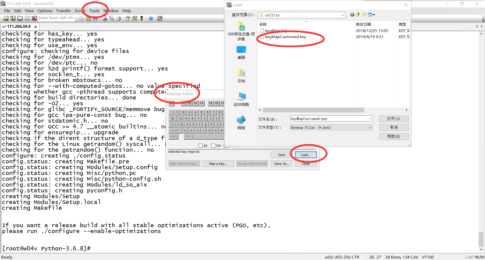
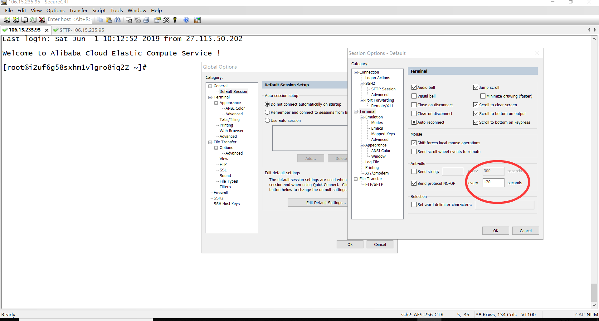
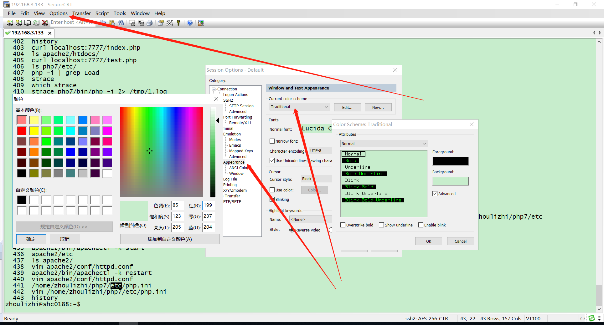
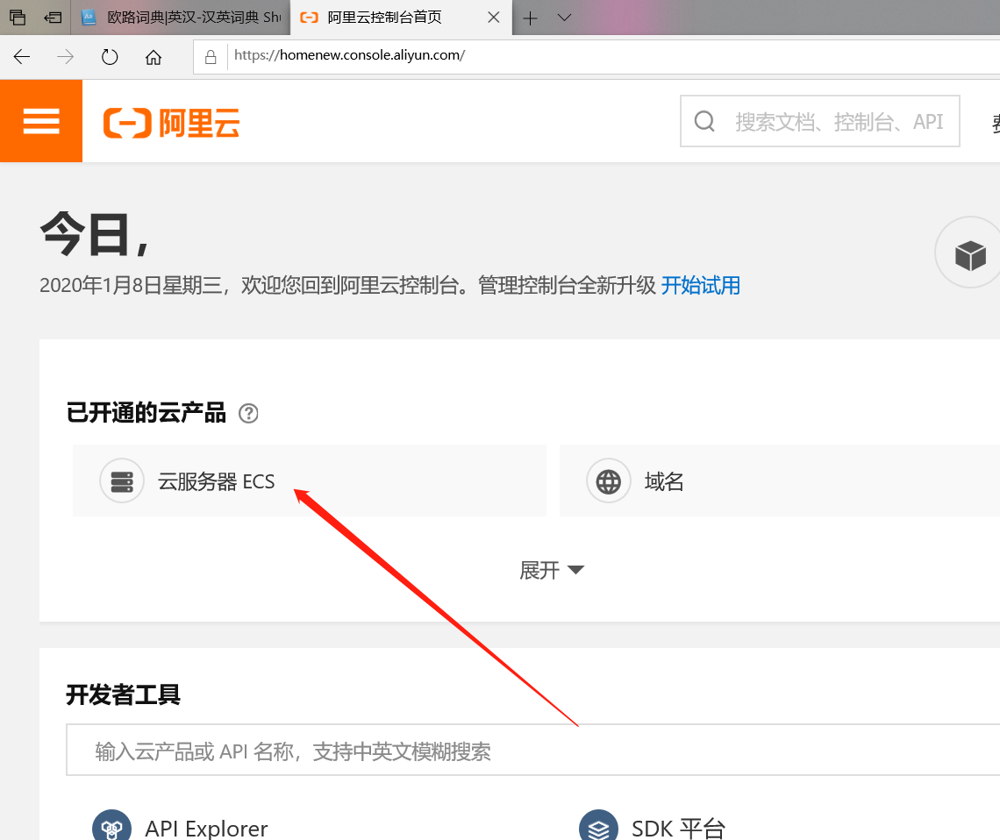
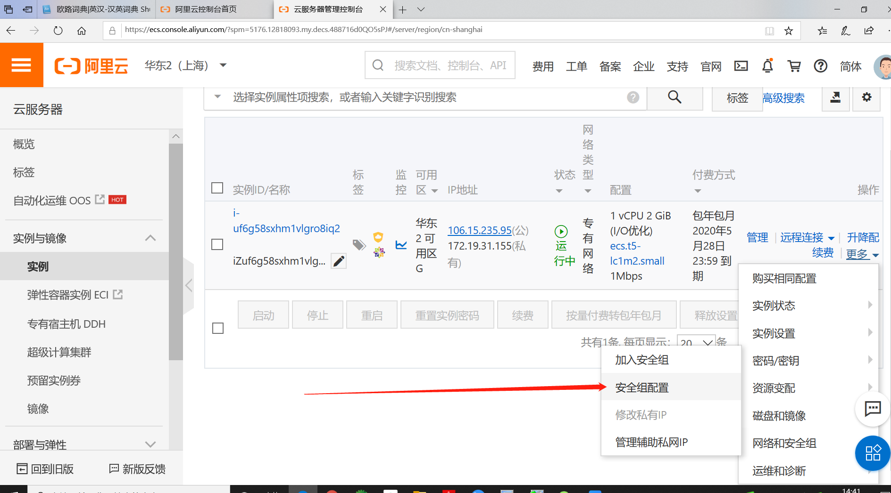
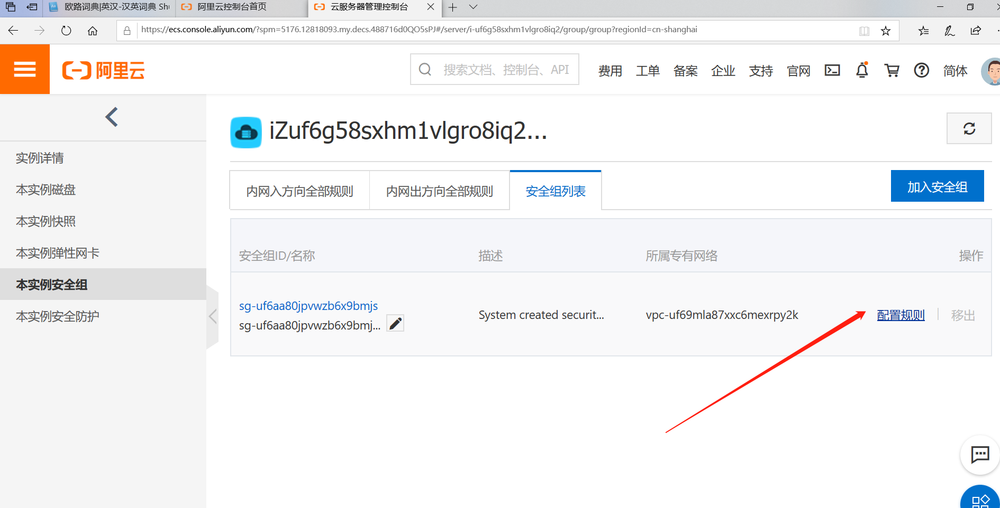
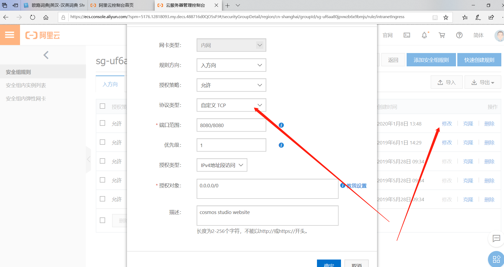

# 
 Linux环境配置

## 终端配置

我主要使用SecureCRTPortable作为访问linux和在linux环境下调试工程代码的工具。  
参考网址：  
https://www.cnblogs.com/zlslch/p/5844479.html  
修改home,end,delete等键盘键，使其与windowns一致：  

   

其中keyMapCustomed.key是自定义的key文件。
参考网址：

https://blog.csdn.net/need_er/article/details/17753481  
END = \033[4~  
HOME = \033[1~  
DELETE= \033[3~  
utf8编码问题,应作以下配置:  

   

如果CRT经常掉线：(automatic logout)  

   

修改文件夹权限：  
chmod -R 777 /home/zlz/python3/  
修改终端背景色：  

   

## 查看liux版本

https://blog.csdn.net/huosenbulusi/article/details/85763189

cat /proc/version  
uname -a  
uname -r  
lsb_release -a  
cat /etc/issue  
cat /etc/*release*  
getconf LONG_BIT  
（用于查看32位还是64位）  
对于CentOS系统：  
cat /etc/redhat-release  
参考网址：  
https://blog.csdn.net/comeoncomputer/article/details/78659033  

question: how to install jdk1.8
solution: 
env
vi etc/profile
(keyboard)
ins

export JAVA_HOME=/opt/ucc/comp/jdk1.8.0_65
export PATH=$PATH:$JAVA_HOME/bin
export CLASSPATH=$JAVA_HOME/lib/dt.jar:$JAVA_HOME/tools.jar:$JAVA_HOME/jre/bin

question: quick tutorial 
solution: 
http://www.computerhope.com/issues/chshell.htm

question: how to zip a folder?
solution: 
tar zcvf FileName.tar.gz DirName
tar zcvf FileName.tar.gz DirName1 DirName2 DirName3 

question: how to unzip / gunzip
solution: 
http://man.linuxde.net/unzip
http://man.linuxde.net/gunzip

question: how to untar
solution:
tar -zxvf solution/download/Python-3.6.8.tgz -C local/ #untar to a specific directory
tar -xvf  jdk-8u65-linux-x64.tar
tar -xvf file.tar //解压 tar包
tar -xzvf file.tar.gz //解压tar.gz
tar -xjvf file.tar.bz2 //解压 tar.bz2
tar -xZvf file.tar.Z //解压tar.Z
unrar e file.rar //解压rar
unzip file.zip //解压zip
1、*.tar 用 tar –xvf 解压
2、*.gz 用 gzip -d或者gunzip 解压
3、*.tar.gz和*.tgz 用 tar –xzf 解压
4、*.bz2 用 bzip2 -d或者用bunzip2 解压
5、*.tar.bz2用tar –xjf 解压
6、*.Z 用 uncompress 解压
7、*.tar.Z 用tar –xZf 解压
8、*.rar 用 unrar e解压
9、*.zip 用 unzip 解压

question: how to ping
solution:
ping 172.16.0.7

question: how to telnet
solution:
telnet 172.16.0.7 22

question: how to restart mysql 
solution:
service mysqld restart
service mysqld status
service mysql restart
service mysql start
service mysql stop

question: how to show the size of a folder?
solution:
du -sh logs
du -h --max-depth=1 webapps
du -h -a --max-depth=1  webapps

question: how to set the file etc/hosts
solution:
127.0.0.1   localhost localhost.localdomain localhost4 localhost4.localdomain4
::1         localhost localhost.localdomain localhost6 localhost6.localdomain6
172.16.16.118 iZbp1atpcr5dj5v2kooc8oZ
IPaddress  iZbp1atpcr5dj5v2kooc8oZ

question: how to delete file and folder?
solution:
rm -rf folderName
rm -f file.ext
for example, if you are deleting 同义词表ET2.1.2(1.29万).txt, then type the following code
rm -f 同义词表ET2.1.2\(1.29万\).txt
if the file name contains white spaces, then quote it!
rm -f "dep - 副本.txt" 

question: how to check free memory?
solution: free -m

question: how to resize the VM heap space in tomcat?
solution: 
edit
/opt/ucc/apache-tomcat-7.0.47/bin/catalina.sh
find the line: 
JAVA_OPTS="-Xms1024m -Xmx4096m -Xss1024K -XX:PermSize=512m -XX:MaxPermSize=1024m "

question: how to make effective a configuration file?
solution: . /etc/profile

question: how to move file?
solution: 
mv /tmp/tomcat.zip /usr/local
mv /opt/nfsdata/opt/nfsdata/models /opt/nfsdata/
mv /opt/intelligence/ /opt/ucc/
mv /root/jdk1.8.0_65/ /opt/ucc/

mv    /usr/lib/*    /zone
是将 /usr/lib/下所有的东西移到/zone/中。
mv    /usr/lib/*.txt    /zone
是将lib下以txt结尾的所有文件移到/zone中。 

question: how to copy file?
solution: 
cp /opt/ucc/intelligence/robot.properties /opt/ucc/

question: how to ADJUST TIME IN LINUX?
solution: 
ntpdate pool.ntp.org  
ntpdate time.nist.gov
date --help
date 
date -s 10:15:10  

question: how to make a new folder?
solution: mkdir newFolder

question: how to DELETE a folder/FILE?
solution: 
删除文件夹实例：
rm -rf /var/log/httpd/access
将会删除/var/log/httpd/access目录以及其下所有文件、文件夹
删除文件使用实例：
rm -f /var/log/httpd/access.log
将会强制删除/var/log/httpd/access.log这个文件

question: how to CREATE A LINK TO A FOLDER?
solution: 
ln -s /usr/java/jdk1.8.0_60/ /usr/jdk

question: how to check linux version?
solution: cat /proc/version 

question: how to check linux thread?
solution: 
ps -ef|grep tomcat
ps -ef|prep openfire
ps -ef| grep 13873

question: how to install gcc/g++/nasm?
solution: 
yum install gcc-c++ libstdc++-devel
yum install openssh-server
yum install gdb-gdbserver 
yum install gdb

which g++
g++ --version
which gcc
gcc -v
gcc --version
which gdb
gdb -v

wget https://ftp.gnu.org/gnu/gcc/gcc-4.8.2/gcc-4.8.2.tar.gz
tar -xf gcc-4.8.2.tar.gz
cd gcc-4.8.2
./contrib/download_prerequisites
mkdir gcc-build-4.8.2; cd gcc-build-4.8.2
../configure --enable-checking=release --enable-languages=c,c++ --disable-multilib
make && make install
gcc -v

tar -xvf solution/download/nasm-2.14.02.tar.gz
cd nasm-2.14.02/
./configure 
make && make install

question: how to CREATE short cut to a folder?
solution: 
ln -s 源目录 目标快捷方式
比如你要在/etc下面建立一个叫LXBC553的快捷方式，指向/home/LXBC，那就是
ln -s /home/LXBC /etc/LXBC553 
ln -s /opt/ucc/www/tomcat-7.0.70 /opt/ucc/tomcat

question: How do I make Bash my default shell on Ubuntu?
solution: 
Enable bash:
$ /bin/bash
Change shell for user:
$ sudo usermod -s /bin/bash username

question: How do change the access right for a file / folder?
solution: 
ls -l sample.txt
chmod 664 a.txt
chmod -R 777 /home/user #recursively apply the change!
chown user sample.txt
chown : user sample.txt #改变所属组

question: how to view infor of linux system?
solution: 
uname -a 
cat /proc/version
cat /etc/issue
cat /proc/cpuinfo
getconf LONG_BIT

question: how to view infor for GPU?
solution: 
before install cuda:
sudo service lightdm stop
after install cuda:
sudo service lightdm start

lspci | grep -i nvidia
nvidia-smi
watch -n 10 nvidia-smi
sudo lshw -numeric -C display
cat /usr/local/cuda/version.txt
cat /usr/local/cuda/include/cudnn.h | grep CUDNN_MAJOR -A 2 # after
cat /usr/local/cuda/include/cudnn.h | grep CUDNN_MAJOR -B 2 # before
cat /usr/local/cuda/include/cudnn.h | grep CUDNN_MAJOR -C 2 # both

question: how to view infor for python?
solution: 
python -V
whereis python
python
python  --version
which python

install dependencies before install python3.6!!!
sudo apt-get install sqlite3
sudo apt-get install libsqlite3-dev  
sudo apt-get install openssl
sudo apt-get install libssl-dev
sudo apt-get install libreadline-dev  

./configure --prefix=/home/zlz/python3 --with-ssl
or
./configure --prefix=/home/zlz/python3 --with-openssl=/usr/bin/openssl
make
sodu make install
whereis nasm
nasm --version
 
 
question: how to alter the python version?
solution: 
cd /usr/bin
ls -l | grep python
sudo rm -rf python
sudo ln -s /usr/bin/python3  /usr/bin/python
sudo ln -s /home/zlz/local/python3/bin/pip3.5  /usr/bin/pip3
sudo ln -s /home/zlz/local/python3/bin/gunicorn  /usr/bin/gunicorn

question: how to install tensorflow?
solution: 
tar -zxvf setuptools-19.6.tar.gz
cd setuptools-19.6/
python3 setup.py build
python3 setup.py install
tar -zxvf pip-18.1.tar.gz 
cd pip-18.1/
python3 setup.py build
python3 setup.py install
pip3 --version
sudo rm /usr/bin/pip3
sudo ln -n /home/zlz/local/python3/bin/pip /usr/bin/pip3

change tensorflow_gpu-1.8.0-cp35-cp35m-manylinux1_x86_64.whl into tensorflow_gpu-1.8.0-cp35-cp35m-linux_x86_64.whl
and then
pip3 install tensorflow_gpu-1.8.0-cp35-cp35m-linux_x86_64.whl

hint:
import pip; 
print(pip.pep425tags.get_supported())

install all the dependent packages:
absl-py>=0.1.6 (from tensorflow-gpu==1.8.0) (0.6.1)
gast>=0.2.0 (from tensorflow-gpu==1.8.0) (0.2.0)
numpy>=1.13.3 (from tensorflow-gpu==1.8.0) (1.15.4)
grpcio>=1.8.6 (from tensorflow-gpu==1.8.0) (1.17.0)
termcolor>=1.1.0 (from tensorflow-gpu==1.8.0) (1.1.0)
astor>=0.6.0 (from tensorflow-gpu==1.8.0) (0.7.1)
protobuf>=3.4.0 (from tensorflow-gpu==1.8.0) (3.6.1)
six>=1.10.0 (from tensorflow-gpu==1.8.0) (1.12.0)

wheel>=0.26 (from tensorflow-gpu==1.8.0) (0.32.3)
setuptools (from protobuf>=3.4.0->tensorflow-gpu==1.8.0) (28.8.0)
werkzeug>=0.11.10 (from tensorboard<1.9.0,>=1.8.0->tensorflow-gpu==1.8.0) (0.14.1)
markdown>=2.6.8 (from tensorboard<1.9.0,>=1.8.0->tensorflow-gpu==1.8.0) (3.0.1)
html5lib==0.9999999 (from tensorboard<1.9.0,>=1.8.0->tensorflow-gpu==1.8.0) (0.9999999)
bleach==1.5.0 (from tensorboard<1.9.0,>=1.8.0->tensorflow-gpu==1.8.0) (1.5.0)
tensorboard<1.9.0,>=1.8.0 (from tensorflow-gpu==1.8.0) (1.8.0)

https://developer.nvidia.com/rdp/cudnn-download

cp cudnn-8.0-linux-x64-v6.0.solitairetheme8 cudnn-8.0-linux-x64-v6.0.tgz
tar -xzf cudnn-8.0-linux-x64-v6.0.tgz

cp cudnn-10.0-linux-x64-v7.5.0.56.solitairetheme8 cudnn-10.0-linux-x64-v7.5.0.56.tgz
tar -xzf cudnn-10.0-linux-x64-v7.5.0.56.tgz

sudo cp cuda/include/cudnn.h /usr/local/cuda/include
sudo cp -a cuda/lib64/libcudnn* /usr/local/cuda/lib64
sudo chmod a+r /usr/local/cuda/include/cudnn.h /usr/local/cuda/lib64/libcudnn*
 
question: how to use gunicorn?
solution:  
gunicorn test:app -w 8 -D -b '127.0.0.1:5007' -p test.pid
gunicorn interface:app -c interface.conf

curl http://192.168.2.39:5007
tail -100f log/log.txt
cat log/log.txt 
pstree -ap|grep gunicorn
kill -HUP $(cat interface.pid)
kill -9 $(cat interface.pid)
lsof -i tcp:5007
lsof -i:9999

question: how to view log for tomcat?
solution: 
ps -ef|grep tomcat
sh /opt/ucc/tomcat/bin/shutdown.sh
sh /opt/ucc/tomcat/bin/startup.sh
tail -100f /opt/ucc/tomcat/logs/catalina.out

cat -n /opt/ucc/tomcat/logs/catalina.out | grep "correct percent for Negative Struct = " 
cat -n catalina.out |tail -n 10 
cat -n catalina.out |head -n 10
cat -n catalina.out | grep "2016-09.*public String update() throws ParseException	Exception" | more
cat -n catalina.out | grep "2016-09.*public String update() throws ParseException	Exception" | less
cat -n catalina.out | tail -n +16094891 | head -100
cat -n catalina.out | tail -n +16094791 | head -150
cat -n catalina.out | tail -n +12314828 | head -n 1000
cat -n catalina.out | grep "2016-08-22.*synchronized String update" 

tail -n 100 /opt/ucc/tomcat/logs/catalina.out
more +3010851 /opt/ucc/tomcat/logs/catalina.out
tail -f catalina.out
tail -f JtalkManager.log
tail -100f /opt/ucc/tomcat/logs/catalina.out
tail -100f /opt/ucc/tomcat/logs/catalina.out
cat -n /opt/ucc/tomcat/logs/catalina.out | tail -100 | head -1
tail -100f /opt/ucc/www/tomcat-7.0.70/logs/catalina.out
tail -f /opt/ucc/www/tomcat-7.0.70/logs/catalina.out
tail -f /opt/ucc/www/tomcat-7.0.70/logs/error.log

question: how to execute python file in background?
solution: 
nohup python -u test.py > out.log 2>&1 &

question: how to transfer file to another server?
solution: 
scp /opt/ucc/comp/jdk-8u65-linux-x64.tar.gz root@192.168.11.61:/opt/ucc/comp/
scp -r /opt/ucc/comp/ root@121.40.130.192:/opt/ucc/comp/jdk-8u65-linux-x64.tar.gz
对拷文件夹 (包括文件夹本身)
scp -r /home/wwwroot/www/charts/util root@192.168.1.65:/home/wwwroot/limesurvey_back/scp
对拷文件夹下所有文件 (不包括文件夹本身)
scp /home/wwwroot/www/charts/util/* root@192.168.1.65:/home/wwwroot/limesurvey_back/scp
对拷文件并重命名
scp /home/wwwroot/www/charts/util/a.txt root@192.168.1.65:/home/wwwroot/limesurvey_back/scp/b.text

curl -O -L http://downloads.sourceforge.net/project/sshpass/sshpass/1.05/sshpass-1.05.tar.gz && tar xvzf sshpass-1.05.tar.gz && cd sshpass-1.05 && ./configure && make && sudo make install
use git-bash
sshpass -p 123456 scp /d/360/solution/Python/templates/index.html  zlz@192.168.2.39:/home/zlz/solution/Python/templates
scp /d/360/solution/Python/templates/index.html  zlz@192.168.2.39:/home/zlz/solution/Python/templates
scp d:/360/solution/Python/templates/index.html  zlz@192.168.2.39:/home/zlz/solution/Python/templates

curl -O -L http://downloads.sourceforge.net/project/sshpass/sshpass/1.05/sshpass-1.05.tar.gz 
tar xvzf sshpass-1.05.tar.gz 
cd sshpass-1.05 && ./configure && make && sudo make install

## 修改环境变量
参考网址：  
https://www.cnblogs.com/hust-chenming/p/4943268.html  
vim ~/.bashrc  
#在最后一行添加：  
export PATH=/usr/local/sbin:/usr/local/bin:/sbin:/bin:/usr/sbin:/usr/bin:/root/bin  
source ~/.bashrc  

## 日志查看grep
cat -n ../log/error8000.txt | grep "now is the time =" | more  
获取日志行号，比如27119 ，然后输入：  
more +27119 ../log/error8000.txt  

grep -B 2 "^”接地" /mnt/nas/bert_poc_data/H/desc_h_background_data.txt | more  

## SFTP数据传输
文件传输指令（从本地到远程）：  
scp /home/zhoulizhi/gitlab/assets/example.txt lizhi@192.168.3.132:/home/lizhi/gitlab/assets  
文件夹传输指令（从本地到远程）：  
scp -r /home/zhoulizhi/gitlab/assets/folder lizhi@192.168.3.132:/home/lizhi/gitlab/assets  

文件传输指令（从远程到本地）：  
scp lizhi@192.168.3.132:/home/lizhi/gitlab/assets/example.txt /home/zhoulizhi/gitlab/assets   
文件夹传输指令（从远程到本地）：  
scp -r lizhi@192.168.3.132:/home/zhoulizhi/gitlab/assets/folder /home/lizhi/gitlab/assets  

如果出现SFTP不能连接问题：  
vi /etc/ssh/sshd_config   
将  
 #Subsystem       sftp    /usr/libexec/openssh/sftp-server  
改为  
Subsystem       sftp    /usr/libexec/openssh/sftp-server  

## 阿里云服务器端口配置方法

[云解析 DNS (aliyun.com)](https://dns.console.aliyun.com/?spm=5176.2020520101.nav-right.2.368a4df5yF8Fo2#/dns/domainList)

进入阿里云服务器配置网站  
https://ecs.console.aliyun.com/#/server/region/cn-shanghai

   

   

   

   

   

域名购买：  
https://domain.console.aliyun.com/index.htm#/buyer/demandInfoList  
https://dc.console.aliyun.com/next/index#/domain/list/all-domain  

域名备案：  
https://beian.aliyun.com/pcContainer/myorder  
域名证书下载；  
https://dc.console.aliyun.com/next/index#/domain/details/cert-print?saleId=S20208O1A4N63433&domain=axiom.top  

软件著作权  
https://tm.aliyun.com/channel/copyright/new?spm=a2cmq.17629970.0.0.f0d079fe3HRL3T  

