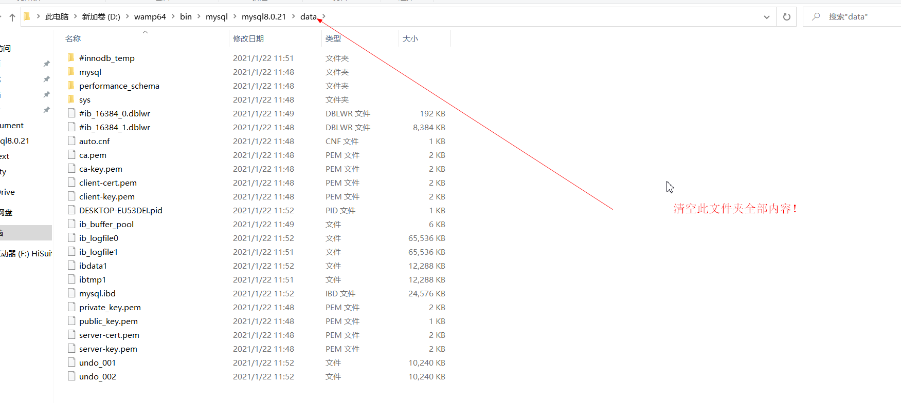
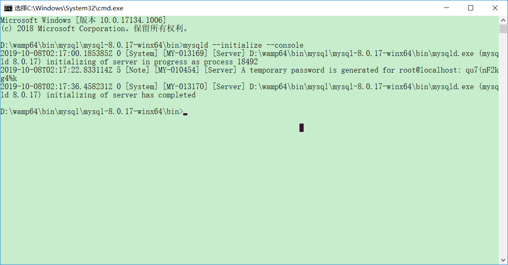
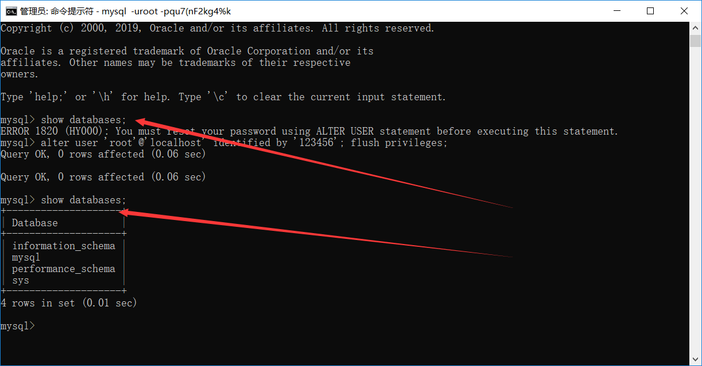
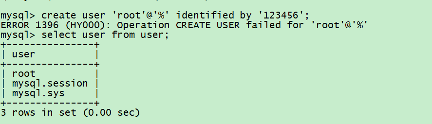
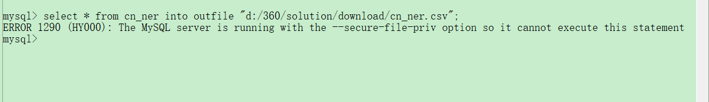
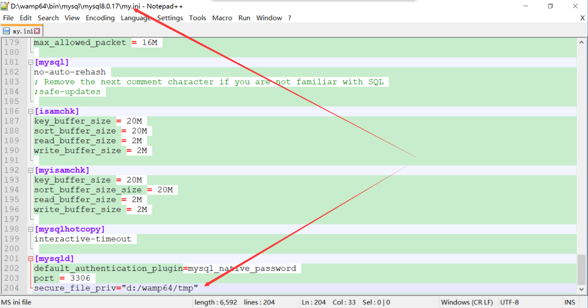
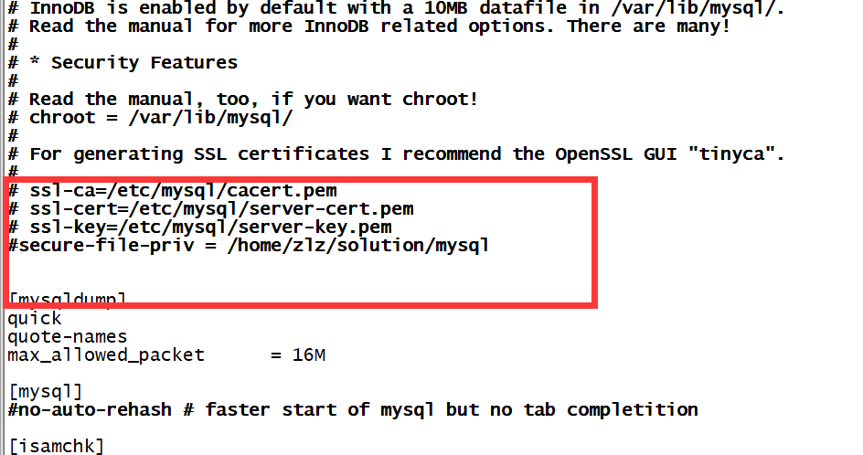
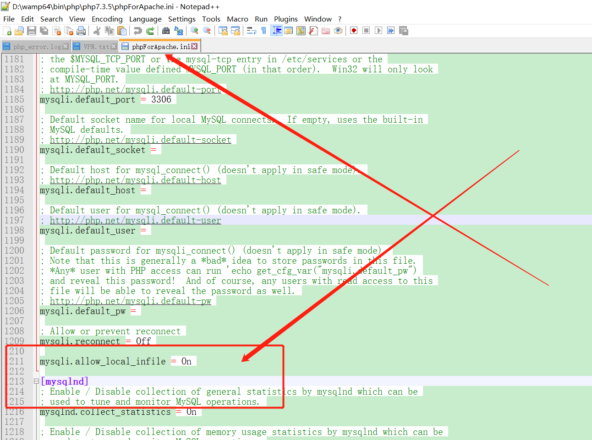
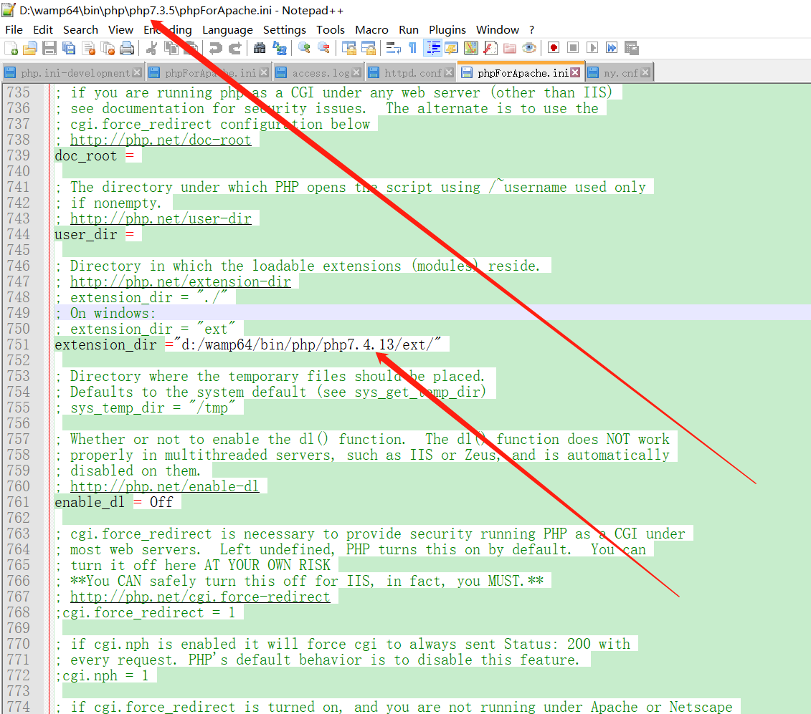
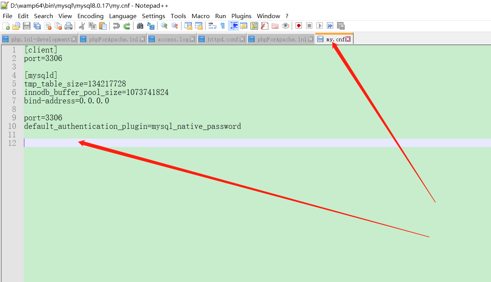

# 
 Mysql操作指南

## windows版本安装

直接使用wampserver内置的mysql使用方法：  
清空D:\wamp64\bin\mysql\mysql8.0.21\data内的所有内容！  
如果没有data文件夹，新建一个data文件夹。  

  
cd D:\wamp64\bin\mysql\mysql8.0.21\bin  
然后执行：  
mysqld --initialize --console  

  
鼠标左键后选择wamp图标中的MySQL 8.0.21->Service administration (wampmysqld64)->install Service  

  
此时输入命令services.msc可以查看服务已被安装：  

  

鼠标左键后选择wamp图标中的MySQL 8.0.21->MySQL Console   

  
  

输入之前的password后就登陆成功了：  

  

下载地址：
https://dev.mysql.com/downloads/mysql/
然后根据不同的操作系统，选择不同版本的MYSQL即可。
python调用mysql使用
pip3 install mysql-connector

windows下安装mysql8.0并集成到wamp中的方法：
参考网址：
https://blog.csdn.net/liuxl57805678/article/details/88546263

  

放在自己的wamp环境下的D:\wamp64\bin\mysql目录下  

  

解压重命名为mysql8.0.17  
把原始mysql版本目录下的my.ini和wampserver.conf 文件拷贝到mysql8.0.17目录中，并更改my.ini文件中的配置路径信息：  
basedir="D:/wamp64/bin/mysql/mysql8.0.17"  
datadir="D:/wamp64/bin/mysql/mysql8.0.17/data"  
lc-messages-dir="D:/wamp64/bin/mysql/mysql8.0.17/share"  

  

设置环境变量: (D:\wamp64\bin\mysql\mysql8.0.17\bin =>PATH)  
Path += D:\wamp64\bin\mysql\mysql8.0.21\bin  

  

初始化Mysql  （一定要在mysql8.0.17的bin目录下执行）  
mysqld --initialize --console  

如果之前安装过，请执行sc delete MySQL
如图：

  

  

A temporary password is generated for root@localhost: qu7(nF2kg4%k  
执行：  
mysqld -install  

  

启动mysql  

  
输入命令：mysql -uroot -pqu7(nF2kg4%k

  

如果不支持cmd输入密码，则输入mysql -uroot -p然后再键入密码，如图：  

  

输入show databases;  
会出现以下提示：  

  

输入以下命令：  
alter user 'root'@'localhost' identified by '123456'; flush privileges;  

然后再输入：  
show databases;  

  

  

## Linux版本安装
假设当前目录为httpd和php的安装目录：  
git clone --depth=1 https://github.com/cosmosZhou/shell.git  

cd shell/mysql  
make 

make start

然后键入初始密码后会报以下错误：  
ERROR 2002 (HY000): Can't connect to local MySQL server through socket '/tmp/mysql.sock' (2)  

然后创建软连接即可：
ln -s /usr/local/mysql/mysql.sock /tmp/mysql.sock  

## mysql启动与关闭

在windows系统中使用services.msc命令来打开服务管理界面：  

  

  

选择mysql80打开如图：  

  

单击“停止(T)”或“启动(S)”即可实现mysqlr 停止和启动。  
如果是linux系统，使用以下命令即可：  
service mysql start   
service mysql stop   
service mysql restart  
 #mysqladmin -uroot shutdown　　  

tasklist|findstr "mysql"  
taskkill/f /t /im mysqld.exe  
net stop mysql  
net start mysql  

## mysql登陆
使用以下命令可登陆mysql数据库：  
mysql -h 192.168.3.67 -P 3306 -uroot -p123456  
mysql -uroot -p123456 -Dcorpus --local-infile=1  
其中-h指定mysql服务所在的IP地址，如果需要访问远程mysql服务可以用到该参数。  
-P是端口号  
-u是用户名  
-p是密码  

使用以下命令可以设置默认用户名及密码：  
mysql_config_editor set --host=localhost --user=root --password=123456  

在访问远程MYSQL时如果MYSQL版本不一致会登陆失败，  
此时要在服务端作以下设置：  
create user 'root'@'%' identified by '123456';  
  

如果报错参考  
https://blog.csdn.net/u011575570/article/details/51438841  
drop user 'root'@'%';  

grant all privileges on *.* to 'root'@'%' with grant option;  
flush privileges;  
ALTER USER 'root'@'%' IDENTIFIED WITH mysql_native_password BY '123456';  
然后在用户端就可以远程访问了。  

如果报以下错误：  
Mysql远程登录报错：Host '192.168.1.3' is not allowed to connect to this MySQL server  
登录数据库：mysql -u root -p123456  
mysql>use mysql;  
mysql>update user set host = '%' where user = 'root';  
mysql>select host, user from user;  
mysql>flush privileges;  
参考网址：  
https://www.cnblogs.com/mindouer-2016/p/7685821.html  

## 修改数据储存地址

Mysql默认数据储存地址放在系统盘，会导致系统运行速度变慢，最好把数据储存地址改到其它盘。  
打开以下文件：  
 C:\ProgramData\MySQL\MySQL Server 8.0\my.ini  
 
 
   

修改成:  
 #datadir=C:/ProgramData/MySQL/MySQL Server 8.0/Data  
datadir=E:/MySQL/Data  
同时将C:/ProgramData/MySQL/MySQL Server 8.0/Data内容复制到E:/MySQL/Data  
然后重启MYSQL即可。  
输入 show variables like '%datadir%';  

   

 #using the following command line to set the user and password for mysql  
 #mysql_config_editor set --host=localhost --user=root --password=123456  
 #reference:   
 #https://dev.mysql.com/doc/dev/connector-python/8.0/
 
## 数据库配置
配置my.ini、my.cnf  
[mysql]  
local-infile=1  

[client]  
port=3306  

[mysqld]  
tmp_table_size=134217728  
innodb_buffer_pool_size=1073741824  
bind-address=0.0.0.0  

port=3306  
default_authentication_plugin=mysql_native_password  
local-infile=1  

 #vim /etc/mysql/my.cnf  
 #secure-file-priv = ""  
 #show variables like 'secure%';  
 #SELECT @@global.secure_file_priv;  
 #in the server side:  
 #create user 'root'@'%' identified by '123456';  
 #grant all privileges on *.* to 'root'@'%' with grant option;  
 #flush privileges;  
 #ALTER USER 'root'@'%' IDENTIFIED WITH mysql_native_password BY '123456'  

 #then in the user side:  
 #mysql -h192.168.3.67 -P3306 -uroot -p123456 -Dcorpus  
 
## 数据传输

 #execute sql file:  
 #mysql> source d:/myprogram/database/db.sql;  

 #export structure and data  
mysqldump -h localhost -uroot -p123456 corpus > corpus.sql  
(注意末尾没有分号;)  
mysqldump -h localhost -uroot -p123456 corpus tbl_structure > tbl_structure.sql  

 #export structure only  
 #mysqldump -h localhost -uroot -p123456  -d corpus > corpus.sql  
 #mysqldump -h localhost -uroot -p123456  -d corpus tbl_structure > tbl_structure.sql  

 #export data only  
 #select * from tbl_structure into outfile "D:/wamp64/tmp/tbl_structure.csv";  
select * from tbl_service into outfile "/var/lib/mysql-files/tbl_service-9-25.csv";  
If the following message prompts:  
The MySQL server is running with the --secure-file-priv option so it cannot execute this statement  

   

show variables like 'secure_file_priv';

   

在windows下做如下修改：  

   

Then retart the mysql server;

   

in linux: do the following:  

   

Then, execute:  
sudo service mysql restart  

 #import data only  
 #service mysql stop  
 #sudo mysqld_safe 
使用load data local infile指令可能会报以下错误：  
ERROR 1148 (42000): The used command is not allowed with this MySQL version  
如果是从php脚本服务中调用load data,在php.ini中添加如下配置：  
在section  
[MySQLi]下添加：  
mysqli.allow_local_infile = On  

   

show global variables like 'local_infile';  
set persist local_infile = 1;  
如果报错：  
ERROR 3549 (HY000): Variables cannot be persisted. Please retry.  
输入以下指令：  
set global local_infile = 1;  
 #mysql --local-infile=1 -uroot  
 #mysql --local-infile=1 -uroot -Dcorpus  

load data local infile "D:/wamp64/tmp/tbl_structure.csv" into table tbl_structure character set utf8;  
load data local infile "/var/lib/mysql-files/tbl_intent.csv" into table tbl_structure character set utf8;  
或者：  
load data local infile "/var/lib/mysql-files/tbl_intent.csv" replace into table tbl_repertoire character set   utf8;  
load data local infile "D:/wamp64/tmp/tbl_intent-9-18.csv" into table tbl_intent character set utf8;  
load data local infile "D:/wamp64/tmp/tbl_service-9-6.csv" into table tbl_service character set utf8;  
在执行大数据传输时，比如以下语句，包含了上百万条记录的表：  
load data local infile "D:/wamp64/tmp/tbl_repertoire-9-18.csv" into table tbl_repertoire character set utf8;  
可能会出现导入失败的问题，作以下处理：  
alter table `tbl_repertoire` drop key text;  

   

参考网址：  
https://blog.csdn.net/u010787690/article/details/80473419  

数据恢复：  
参考网址：  
https://www.cnblogs.com/zifeiy/p/9082870.html  
https://blog.csdn.net/airujingye/article/details/70526943  

1,first NEWLY create the table and the database which is identical to the one you want to recover; ie:  
create database corpus; use corpus;  
CREATE TABLE `tbl_structure` (
  `id` int(11) NOT NULL AUTO_INCREMENT,
  `text` varchar(128) NOT NULL,
  `infix` varchar(2048) NOT NULL,
  `training` tinyint(1) NOT NULL DEFAULT '1',
  PRIMARY KEY (`id`),
  UNIQUE KEY `text` (`text`)
) ENGINE=InnoDB DEFAULT CHARSET=utf8mb4 COLLATE=utf8mb4_0900_ai_ci;  

2, ALTER TABLE tbl_structure DISCARD TABLESPACE;  

3, copy the tbl_structure.idb to the folder:   
D:\wamp64\bin\mysql\mysql8.0.17\data\corpus  

4, ALTER TABLE tbl_structure IMPORT TABLESPACE;  

5, select * from `tbl_structure` limit 100;  

## Mysql错误处理
Warning: mysql_connect(): Server sent charset (255) unknown to the client  
https://www.cnblogs.com/zl0372/p/weiqing.html  
http://www.mamicode.com/info-detail-2333179.html  

Could not connect: The server requested authentication method unknown to the client  
https://blog.csdn.net/youcijibi/article/details/81153789  
https://blog.csdn.net/guoguicheng1314/article/details/80526111  

PHP Fatal error: Uncaught Error: Class 'mysqli' not found in......  
https://blog.csdn.net/qq_38287952/article/details/83412515  

apache2/bin/apachectl -k restart  
mysql报错：  
ERROR 1206 (HY000): The total number of locks exceeds the lock table size   

https://blog.csdn.net/dingweiye123/article/details/80994576  
3221225472 = 3*1024*1024*1024;  
SET global tmp_table_size =3221225472;   
show global variables like "%table_size%";  

SET global innodb_buffer_pool_size=3221225472;  
show global variables like "%buffer_pool_size%";  

alter table tbl_id2feature partition by key() partitions 128;  
关于delete from tbl_id2feature_ limit 10000  
关于后存储空间不变小的问题：  
使用 OPTIMIZE TABLE tbl_id2feature_;进行磁盘优化！  

若出现以下错误：  
本地计算机上的wampmysqld64服务启动后停止，某些服务在未由其他服务或程序使用时将自动停止.  
删除全部mysql安装目录文件，重新安装即可！  

Class 'mysqli' not found  

Uncaught Error: Class 'mysqli' not found  

找到apache所指定的phpForApache.ini  
extension处添加extension=php_mysqli  

这里要确保D:\wamp64\bin\php\php7.4.13\phpForApache.ini被apache所引用！
D:\wamp64\bin\apache\apache2.4.39\bin\php.ini  
它只是个链接，要打开实际所链接的.ini 文件才能生效！  

   

   

   

修改extension_dir ="d:/wamp64/bin/php/php7.4.13/ext/"  
添加extension=php_mysqli  

### caching_sha2_password

   

The server requested authentication method unknown to the client [caching_sha2_password]   
alter user 'root'@'localhost' identified by '123456'; flush privileges;  
alter user 'root'@'localhost' identified with mysql_native_password by '123456'; flush privileges;  
ALTER USER 'root' IDENTIFIED WITH mysql_native_password BY '123456';  
