# 
 Deployment Manual for PHP Project

## 安装php开发环境

https://www.eclipse.org/pdt/#download  
In Eclipse, click Help -> Install New Software and work with *:    http://download.eclipse.org/tools/pdt/updates/6.1  
Or  
https://www.eclipse.org/downloads/download.php?file=/tools/pdt/downloads/pdt-Update-6.1.0.201808281524.zip  
https://blog.csdn.net/weixin_43144260/article/details/82870374  

## 非root用户lamp的安装

假设当前目录为httpd和php的安装目录：  
git clone --depth=1 https://github.com/cosmosZhou/shell.git  

cd shell/php  
make 

启动apache:  
cd ../../   
apache2/bin/apachectl -k restart

## Wampserver的安装

Official websites:  
https://www.wampserver.com/en/download-wampserver-64bits/  

下载Wampserver安装包：  
https://jingyan.baidu.com/article/c74d6000bb70110f6a595d8d.html  
https://sourceforge.net/projects/wampserver/files/latest/download  
如果提示Wampserver安装提示没有找到 msvcp120.dll mysql.exe  
https://www.microsoft.com/zh-CN/download/details.aspx?id=40784  
https://www.microsoft.com/zh-cn/download/confirmation.aspx?id=40784  
下载vcredist_x64安装即可！  
如果启动wampserver时出现无法启动此程序,因为计算机中丢失MSVCR110.dll  
https://www.microsoft.com/zh-CN/download/details.aspx?id=30679  

php7.4及以上版本需要安装Microsoft Visual C++ Redistributable for Visual Studio 2019  
https://download.csdn.net/download/quantum7/12850274  
https://3cb155.link.yunpan.360.cn/lk/surl_y6nN33zXNg6#/-0  

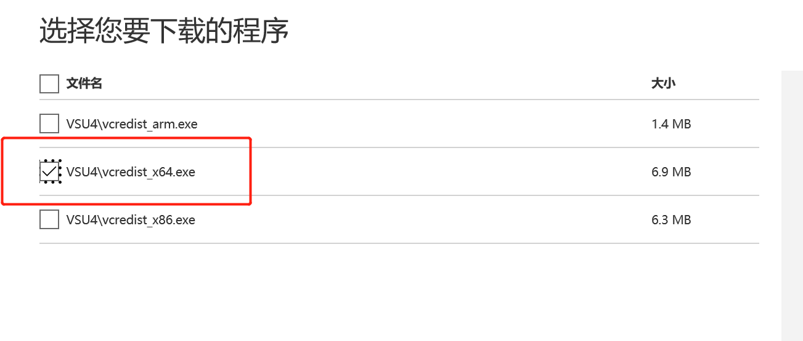  
https://sourceforge.net/projects/phpeclipse/files/latest/download  
http://www.eclipse.org/downloads/packages/release/helios/sr1/eclipse-php-developers  

安装wampserver3.2.3_x64  
下载地址：  
https://sourceforge.net/projects/wampserver/files/WampServer%203/WampServer%203.0.0/wampserver3.2.3_x64.exe/download  
https://yunpan.360.cn/surl_y6nNuCN9J54  
如果缺失：msvcp140.dll (vcruntime140_1.dll,这个错误不影响使用！)  
https://www.microsoft.com/zh-cn/download/confirmation.aspx?id=48145  

要启动Wampserver的话，双击wampmanager.exe即可！  
查看windows版本apache的版本：  
cd D:\wamp64\bin\apache\apache2.4.39\bin  
Httpd -v  

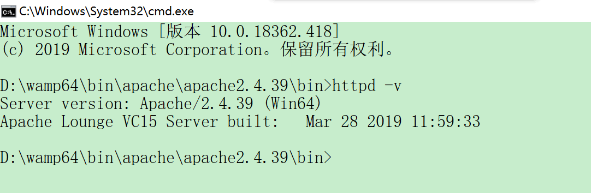  
在浏览器中输入http://localhost  
如果报错命令行中输入：services.msc  

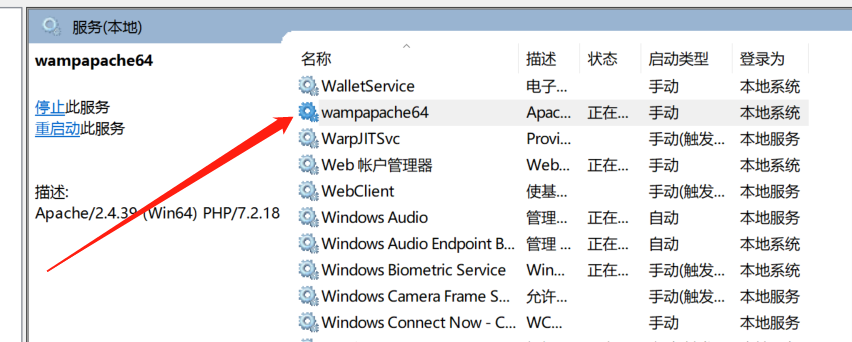  

找到wampapache64启动即可，如果没有找到这个服务；选择apache->service administration->install service即可！  

  

windows下安装php7.4:  
下载php7.4  

[PHP For Windows: Binaries and sources Releases](https://windows.php.net/download#php-7.4)  

  

解压后需要重命名：  

  

修改D:\wamp64\bin\apache\apache2.4.39\conf/httpd.conf  

  
修改后重启wampserver即可。

## curl_init

Call to undefined function curl_init()  

修改D:\wamp64\bin\php\php7.3.5\phpForApache.ini中的  
;extension=curl  
将其改为  
;extension=curl  

观察info.php后发现：  
cURL support	enabled   

重启apache服务器即可！

## 修改DOCUMENT_ROOT

修改D:\wamp64\scripts\config.inc.php  
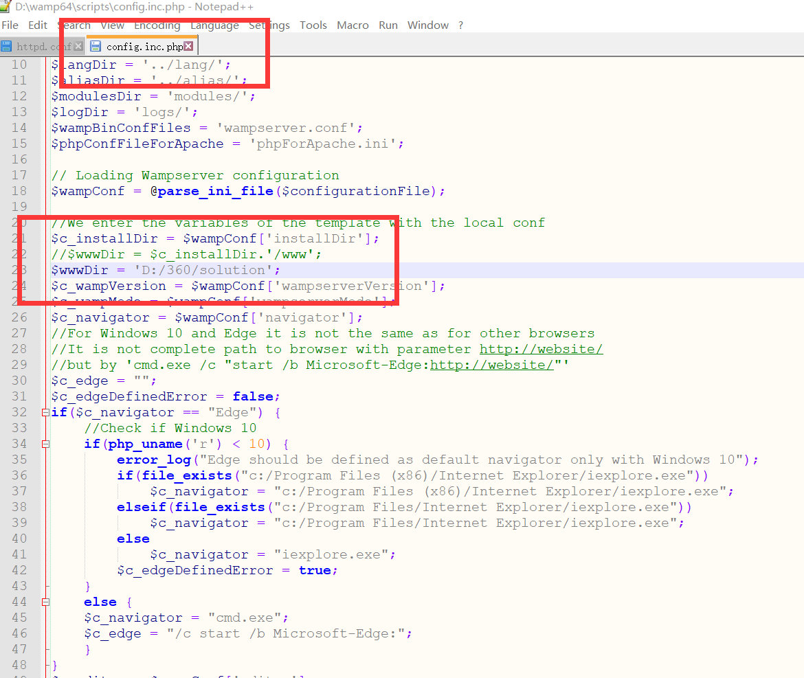  

打开D:\wamp64\bin\apache\apache2.4.39\conf\httpd.conf  

  

打开D:\wamp64\bin\apache\apache2.4.39\conf\extra\httpd-vhosts.conf  

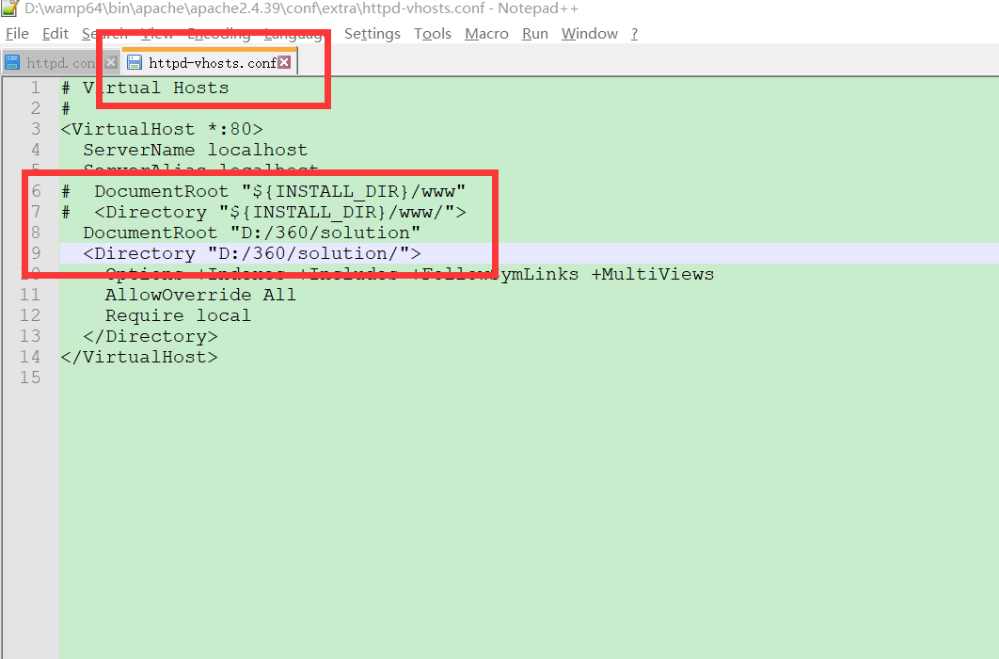  

## 安装Xdebug调试器
参考网址：  
[Xdebug: Documentation » Upgrading from Xdebug 2 to 3](https://xdebug.org/docs/upgrade_guide)  

https://blog.csdn.net/zhanghao143lina/article/details/79050643  
查看phpinfo:  
编写info.php内容如下：
<?php
phpinfo();
?>

  

选择相应的安装程序：  
  

将扩展放到D:\wamp64\bin\php\php7.3.21\ext下：  

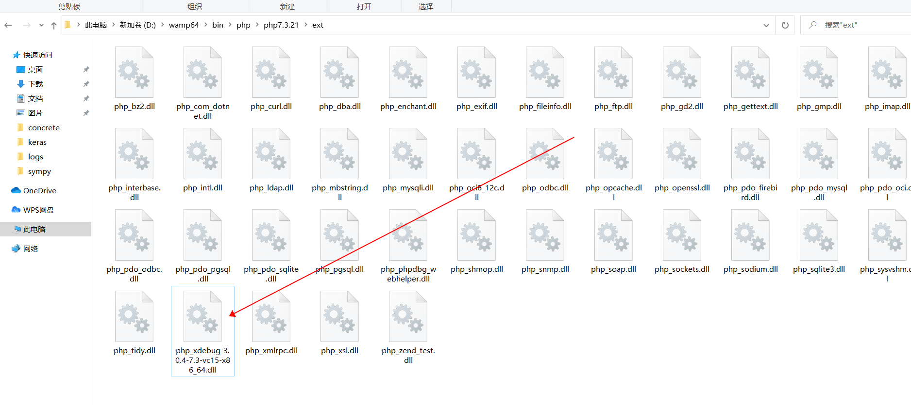  

如果是php7.3版的，php.ini设置如下：  

  

如果是PHP7.4版本的，php.ini设置如下 ：  
[Xdebug]  
zend_extension =php_xdebug-3.0.4-7.4-vc15-x86_64.dll  
xdebug.mode=debug  
xdebug.start_with_request = yes  
xdebug.client_port=9003  
xdebug.client_host=localhost  
xdebug.output_dir="D:\wamp64\tmp\xdebug"  

eclipse的配置是：  

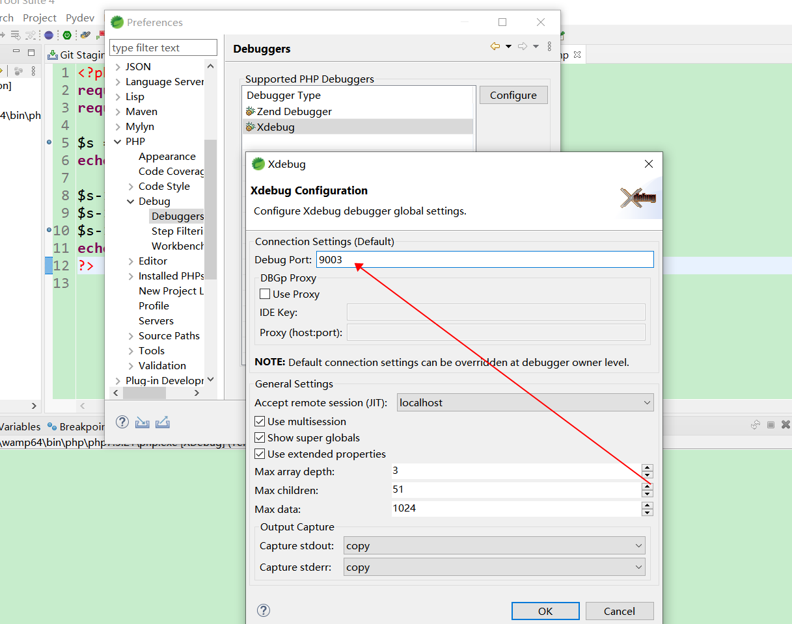  

参考网址：
https://blog.csdn.net/universee/article/details/74502573  
要确保xdebug.remote_port = 9003和Xdebug Configuration中的Debug Port数值一致！  
然后就可以调试php程序了！  

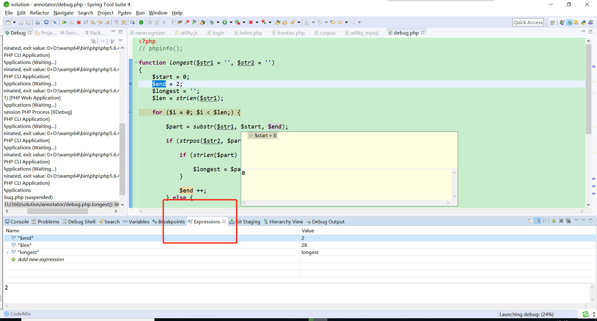  

Debug with $_SERVER["PATH_INFO"]:  

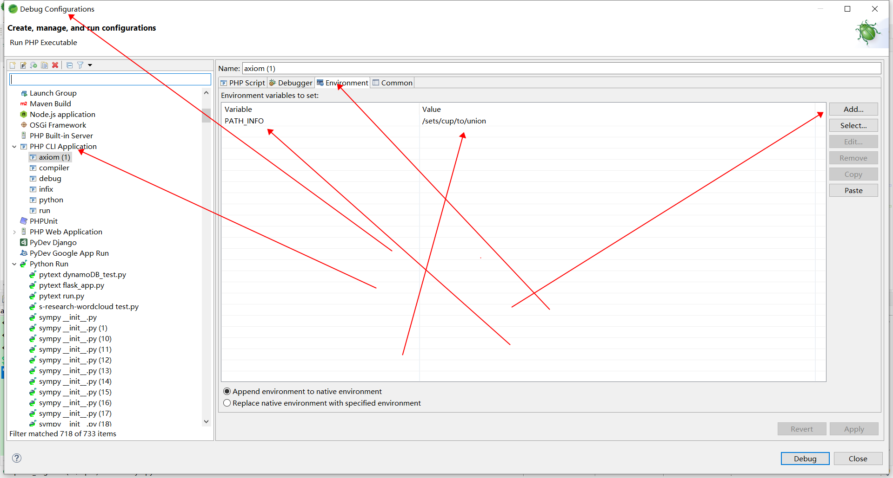  

Debug with getopt:  

  

## 配置cgi调用python脚本

如果在Linux系统下：  
去掉注释：  
 #LoadModule cgid_module modules/mod_cgid.so  
改为：  
LoadModule cgid_module modules/mod_cgid.so   

找到 httpd.conf中DocumentRoot的配置：  
DocumentRoot "E:/gitlab"  
<Directory "E:/gitlab/">  
标签下添加+ExecCGI：  

Options +Indexes +FollowSymLinks +Multiviews +ExecCGI  
或者：  
Options Indexes FollowSymLinks Multiviews ExecCGI  

在\<IfModule alias_module\>标签下修改：  
 #ScriptAlias /cgi-bin/ "${SRVROOT}/cgi-bin/"  
ScriptAlias /cgi-bin/ "${DocumentRoot}/"  

将标签注释掉：  
 #<Directory "${SRVROOT}/cgi-bin">  
 #AllowOverride None  
 #Options None  
 #Require all granted  
 #</Directory>  
在标签\<IfModule mime_module\>下添加：  
AddHandler cgi-script .cgi .py  

设置python.exe路径的系统环境变量：（注意不是用户环境变量！）
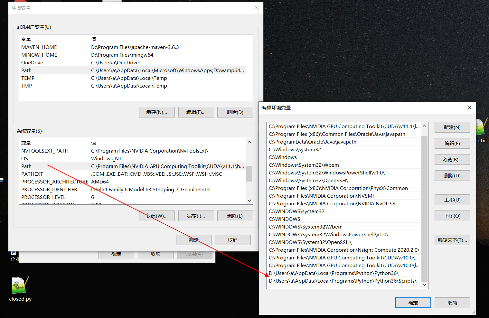  
然后编辑python文件如图所示：
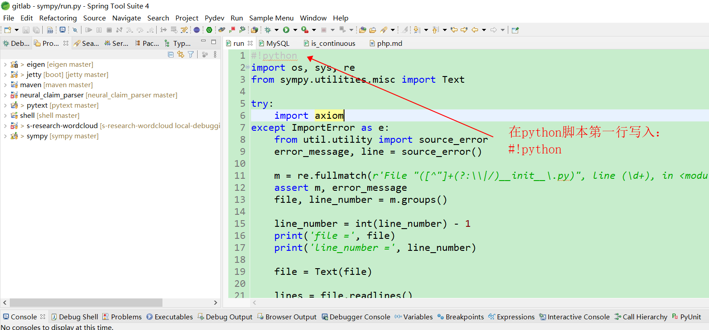  
重启电脑，重启apache 服务即可！  

## 修改php.ini参数
max_input_vars  
在php中通过ini_get('max_input_vars')可以得知max_input_vars的值。  
首先查处配置文件路径：  

  

找到max_input_vars设置的地方：  

  
修改成充分大的数值即可。  
修改max_execution_time  
在php中通过ini_get('max_execution_time')可以得知max_execution_time的值。  
找到max_execution_time设置的地方：
如图：  

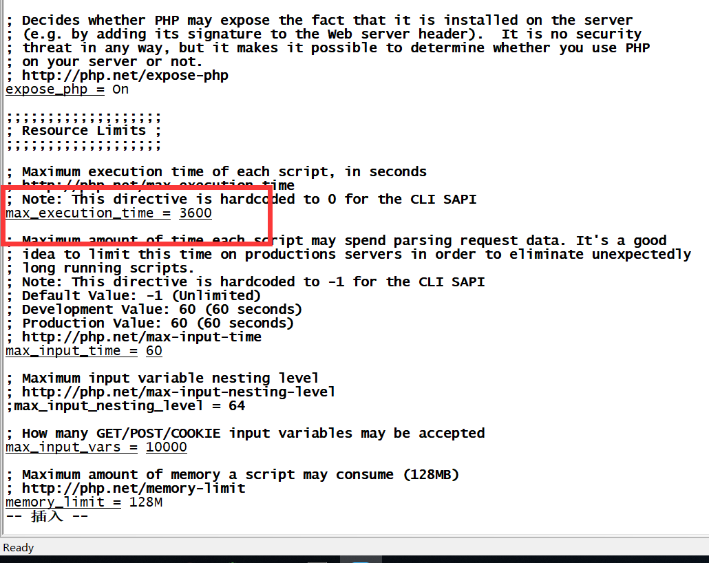  
修改成充分大的数值即可。  
修改display_errors  

  

windows下所做的修改：  

  

## 安装SSL证书

参考文档：  
[在Apache服务器上安装SSL证书 - SSL证书 - 阿里云 (aliyun.com)](https://help.aliyun.com/document_detail/98727.html?spm=a2c4g.11186623.6.627.775e71c2zg3CjM)

### 下载证书
进入
[SSL证书管理控制台 (aliyun.com)](https://yundunnext.console.aliyun.com/?spm=5176.12901015.0.i12901015.4d31525cgqqnhB&p=cas#/overview/cn-hangzhou)
点击证书下载，如图所示：

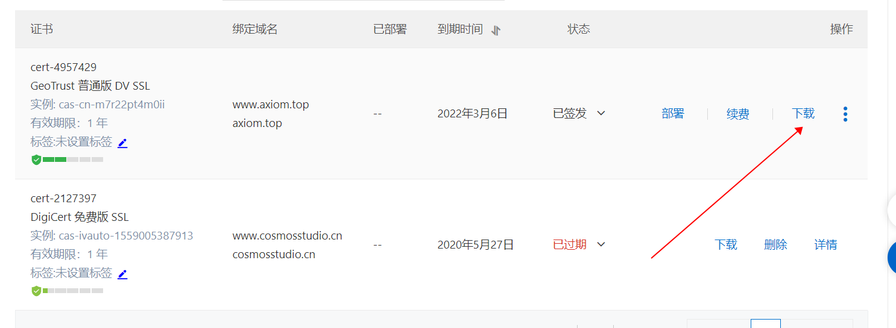  

解压后，将其重命名为www.axiom.top.key, www.axiom.top_chain.crt, www.axiom.top.key_public.crt 
如图所示：  

  
### 开放443端口
进入ecs控制台，概览，安全组，配置规则  
[云服务器管理控制台 (aliyun.com)](https://ecs.console.aliyun.com/#/securityGroupDetail/region/cn-shanghai/groupId/sg-uf6aa80jpvwzb6x9bmjs/detail/intranetIngress)
开放443端口，如图所示：  

  

### 安装证书
进行httpd安装目录：  
cd /usr/local/httpd  
mkdir cert  
将下载的SSL证书复制至/usr/local/httpd/cert文件夹,如图：  

  

### 修改httpd.conf
编辑conf/httpd.conf:    
 #LoadModule ssl_module modules/mod_ssl.so    
 #删除行首的配置语句注释符号“#”加载mod_ssl.so模块启用SSL服务，Apache默认是不启用该模块的。  
 #Include conf/extra/httpd-ssl.conf    
 #删除行首的配置语句注释符号“#”。                   
 #LoadModule socache_shmcb_module modules/mod_socache_shmcb.so  
 #删除行首的配置语句注释符号“#”加载mod_socache_shmcb.so  
 #LoadModule rewrite_module modules/mod_rewrite.so  
 #删除行首的配置语句注释符号“#”加载mod_rewrite.so  
添加如下代码(可选,重定向代码)：  
<VirtualHost *:80>  
    RewriteEngine on  
    RewriteCond %{SERVER_PORT} !^443$  
    RewriteRule ^(.\*)$ https://%{SERVER_NAME}$1 [L,R]  
\</VirtualHost>  
最后保存退出。  

### 修改httpd-ssl.conf
打开conf/extra/httpd-ssl.conf文件并找到以下参数，按照下文中注释内容进行配置。  
<VirtualHost *:443>       
    ServerName   www.axiom.top                     
    DocumentRoot  /home/github            
    SSLEngine on     
    SSLProtocol all -SSLv2 -SSLv3 # 添加SSL协议支持协议，去掉不安全的协议。  
    SSLCipherSuite HIGH:!RC4:!MD5:!aNULL:!eNULL:!NULL:!DH:!EDH:!EXP:+MEDIUM   # 修改加密套件。  
SSLHonorCipherOrder on  
SSLCertificateFile cert/www.axiom.top.key_public.crt  
SSLCertificateKeyFile cert/www.axiom.top.key  
SSLCertificateChainFile cert/www.axiom.top_chain.crt  
</VirtualHost>  
最后保存退出。  
最后重启apache服务：  
apachectl -k stop  
apachectl -k start   
或者：  
apachectl -k restart   

之后再访问网站
打开
www.axiom.top
或者
https://www.axiom.top
之后可以发现没有“不安全”提示语句了！  

