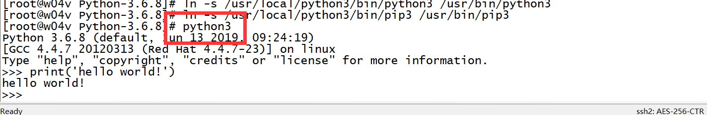
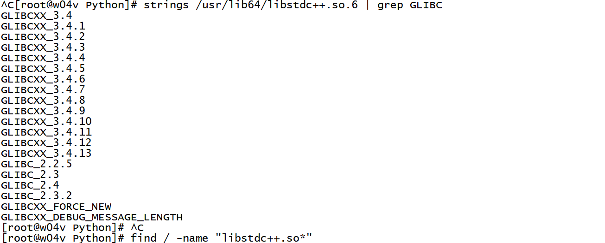
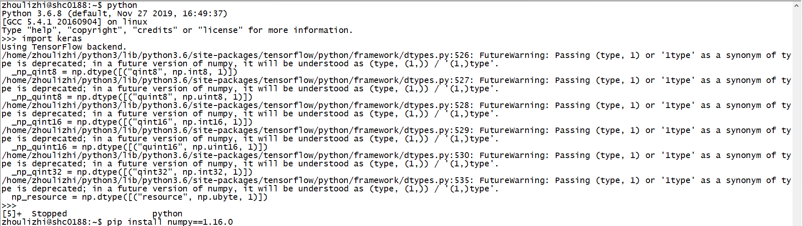
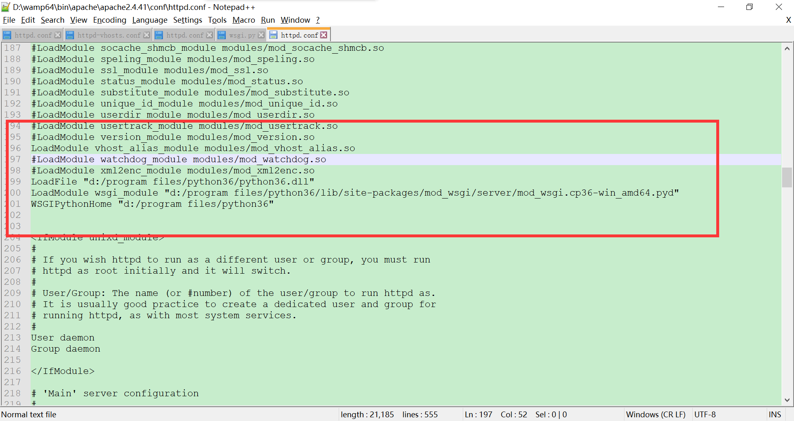
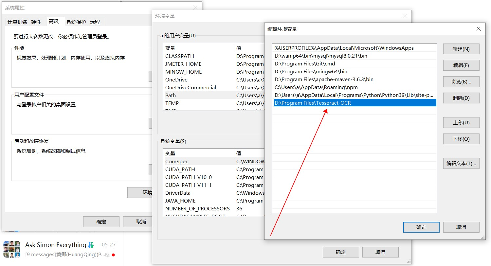
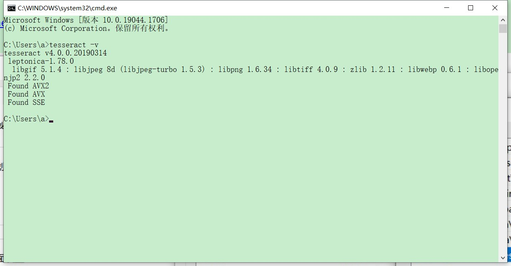

# 
 Python Installation Manual for Workstation

## python语言安装

我使用python3.6版本的，下载地址为：[python-368](https://www.python.org/downloads/release/python-368/)
上有windows和linux版本的，可根据不同操作系统安装不同的版本。

以下是安装linux版python3.6的步骤：  
参考网址：https://www.cnblogs.com/kimyeee/p/7250560.html  
yum -y install zlib-devel bzip2-devel openssl-devel ncurses-devel sqlite-devel readline-devel tk-devel gdbm-devel db4-devel libpcap-devel xz-devel

如果报错请分别执行以下指令：  
yum -y install zlib-devel  
yum -y install bzip2-devel  
yum -y install openssl-devel  
yum -y install ncurses-devel  
yum -y install sqlite-devel  
yum -y install readline-devel  
yum -y install tk-devel  
yum -y install gdbm-devel  
yum -y install db4-devel  
yum -y install libpcap-devel  
yum -y install xz-devel 

mkdir -p /usr/local/python3  
wget https://www.python.org/ftp/python/3.6.8/Python-3.6.8.tgz  
tar -zxvf Python-3.6.8.tgz  
cd Python-3.6.8  
./configure --prefix=/usr/local/python3

如果是个人用户：  
./configure --prefix=/home/zhoulizhi/python3 --enable-loadable-sqlite-extensions

make && make install  
建立必要的软连接：  
ln -s /usr/local/python3/bin/python3 /usr/bin/python3  
(如果建立的软连接python3无效，查看是否有其它版本的python3已经安装，考虑修改环境变量！)  
ln -s /usr/local/python3/bin/pip3 /usr/bin/pip3  

然后在终端命令行输入python3：  
  
就可以输入python3代码了！  
更新pip3  
pip3 install --upgrade pip  

windows下python3安装路径搬家的方法  
把原安装路径内容先复制出来：  
C:\Users\asus\AppData\Local\Programs\Python\Python36  
复制到  
D:\Program Files\Python36  
修改环境变量  
  
最后修改sts的python安装目录：  
  

配置pypi下载源：  
vim ./.pip/pip.conf  

[list]  
format=columns  

[global]  
timeout = 5  
index-url = http://mirrors.aliyun.com/pypi/simple/  
extra-index-url = your-extra-index-url  

[install]  
trusted-host =  
    mirrors.aliyun.com  
    

如果是windows系统：
WIN+R
输入：
%APPDATA%
进入目录新建pip/pip.ini
（比如C:\Users\asus\AppData\Roaming\pip\pip.ini）
录入：

[list]  
format=columns  

[global]
index-url = http://mirrors.aliyun.com/pypi/simple/  
extra-index-url = http://pypi.douban.com/simple
[install]
trusted-host=pypi.douban.com mirrors.aliyun.com

配置modelhubrc:  
vim ~/.modelhubrc  
[aws]  
access_key_id = your_access_key_id  
secret_access_key = your_secret_access_key  
region_name = your_region_name  
bucket_name = your_bucket_name  

[user]  
name = your_user_name  
email = your_email_address  

## Pydev开发环境安装

然后安装编写开发python程序的IDE--pydev,安装方法如下：  
STS(eclipse)->Help->Install New Software->Work with输入：http://www.pydev.org/updates/  
然后按提示安装即可。如图所示：
  

或者可以在help->Eclipse Marketplace中输入pydev,如图所示：  
  

pydef设置：  
  

设置console height:  
  

## Keras/Cuda安装

以下介绍安装深度学习库cuda, cudnn, tensorflow-gpu, keras等  

### GPU显卡
lspci | grep -i vga  
或者  
nvidia-smi  
如果没有，  
如果你的服务器没有GPU显卡，则cuda, cudnn安装可以略过。  
如果有则会输出以下信息：  
  

实时显示GPU使用情况：  
Linux:  
watch -n 1 -d nvidia-smi     #每隔1秒刷新一次  
Windows:  
nvidia-smi –l 5 #每隔5秒刷新一次  
如果nvidia-smi报错如图：  
  
添加C:\Program Files\NVIDIA Corporation\NVSMI到环境变量

### Cuda驱动
CUDA(ComputeUnified Device Architecture)，是显卡厂商NVIDIA推出的运算平台。 CUDA是一种由NVIDIA推出的通用并行计算架构，该架构使GPU能够解决复杂的计算问题。  
下载地址：  
https://developer.nvidia.com/cuda-toolkit-archive  
根据需要安装不同版本的，我安装的是CUDA9，但是linux上安装的是CUDA10  
把以下路径添加到环境变量path中：  
C:\Program Files\NVIDIA GPU Computing Toolkit\CUDA\v9.0\bin  
C:\Program Files\NVIDIA GPU Computing Toolkit\CUDA\v9.0\libnvvp  
如果是cuda11.1则为：  
C:\Program Files\NVIDIA GPU Computing Toolkit\CUDA\v11.1\bin  
C:\Program Files\NVIDIA GPU Computing Toolkit\CUDA\v11.1\libnvvp  

如果是cuda10+win10参考以下网址：  
https://blog.csdn.net/liuyong5573/article/details/85472808  
https://www.jianshu.com/p/7a8fcd11d1f6  

Linux（CUDA10）中作以下设置：  
vim ~/.bash_profile  
export PATH=/usr/local/cuda-10.0/bin:$PATH  
export LD_LIBRARY_PATH=/usr/local/cuda-10.0/lib64  
source ~/.bash_profile  
如果为10.1版本的则为：  
export PATH=/usr/local/cuda-10.1/bin:$PATH  
export LD_LIBRARY_PATH=/usr/local/cuda-10.1/lib64:$LD_LIBRARY_PATH  
使用以下指令查看显存使用情况：  
nvidia-smi  

For example:  
export PATH=~/bin:/usr/local/cuda-10.1/bin:$PATH  
export LD_LIBRARY_PATH=/usr/local/cuda-10.1/lib64:$LD_LIBRARY_PATH  

### cudnn安装

NVIDIA cuDNN是用于深度神经网络的GPU加速库。它强调性能、易用性和低内存开销。NVIDIA cuDNN可以集成到更高级别的机器学习框架中，如谷歌的Tensorflow、加州大学伯克利分校的流行caffe软件。简单的插入式设计可以让开发人员专注于设计和实现神经网络模型，而不是简单调整性能，同时还可以在GPU上实现高性能现代并行计算。

下载网址：  
https://developer.nvidia.com/cudnn  
https://developer.nvidia.com/rdp/cudnn-download  
需要本人用户名和密码登陆！  
  

cuda可以安装10.0或者9.0版本的，cudnn安装的版本是7；  
Reference:  
https://docs.nvidia.com/deeplearning/sdk/cudnn-install/index.html#install-windows  
将下载的cudnn安装包移动至如下文件夹：  
  
  
解压后将解压文件夹（cuda）中的所有文件复制到v10.0文件夹即可！  

### tensorflow安装

如果cuda安装10.0的版本的，那么tensorflow-gpu就是1.13版本的；使用pip3 install tensorflow-gpu==1.13.1安装  
如果cuda安装9.0的版本的，那么tensorflow-gpu就是1.11版本的；使用pip3 install tensorflow-gpu==1.11.0安装  
如果不使用gpu并行运算的，pip3 install tensorflow安装  
（如果报错则用pip3 install tensorflow=='1.11.0'）  
安装tensorflow之后要使用python3终端工具查看tensorflow是否可用：  
输入以下验证指令：  
import tensorflow as tf  
a = tf.constant(1)  
b = tf.constant(1)  
sess = tf.Session()  
sess.run(a - b)  
sess.close()  
如果正常则会出现以下结果：  

  

如果报错：  
ImportError: libcublas.so.10.0: cannot open shared object file: No such file or directory  
输入指令：  
echo $PATH  

  

发现/usr/local/cuda-10.0/bin没有在path列表中。  
返回至本章第2节添加环境变量即可。  

如果出现：  
ImportError: /lib64/libc.so.6: version `GLIBC_2.17' not found   
wget https://ftp.gnu.org/gnu/glibc/glibc-2.17.tar.gz  
tar -xvf glibc-2.17.tar.gz  
cd glibc-2.17  
mkdir build  
cd build  
../configure --prefix=/usr --disable-profile --enable-add-ons --with-headers=/usr/include --with-binutils=/usr/bin  
make && make install  
参考网址  
https://blog.csdn.net/zhoubl668/article/details/80285317  
如果出现：  
ImportError: /usr/lib64/libstdc++.so.6: version `GLIBCXX_3.4.15' not found   
参考网址  
https://blog.csdn.net/yuhuqiao/article/details/83624689  

则执行以下指令  
strings /usr/lib64/libstdc++.so.6 | grep GLIBC  

  

find / -name "libstdc++.so*"  
find / -name "libstdc++.so.6.0.*"  
然后选择版本最高的那一个；  
cp /root/miniconda2/lib/libstdc++.so.6.0.25 /usr/lib64  
rm -rf /usr/lib64/libstdc++.so.6  
ln -s /usr/lib64/libstdc++.so.6.0.25 /usr/lib64/libstdc++.so.6  
然后再：  
strings /usr/lib64/libstdc++.so.6 | grep GLIBC  

  

如果出现以下错误：  
  
请参考  
https://blog.csdn.net/vkingnew/article/details/83317918  

### keras安装
keras安装最新版本即可，使用 pip3 install keras即可。  
如果import keras报以下错误  

  

重新安装numpy即可：  
pip install numpy==1.16.0  
参考网址：  
https://blog.csdn.net/GodLordGee/article/details/100579932  
安装Graphviz  
http://www.graphviz.org/  
如果需要生成keras.Model的可视化流程图，需要安装Graphviz2.38，并添加环境变量，如图所示：  
pip install graphviz  
pip install pydot  
pip install pydot_ng  
Add path: D:\Program Files (x86)\Graphviz2.38\bin  

  

然后在python代码中添加：  
from keras.utils.vis_utils import plot_model  
plot_model(self.model, to_file= 'model.png', show_shapes=True)  

### pytorch安装

pytorch不能使用 pip直接安装，一定要参考官方提供的方案安装：  
https://pytorch.org/get-started/locally/  

比如python3.9+Cuda11.1  
https://download.pytorch.org/whl/cu111/torch-1.9.0%2Bcu111-cp39-cp39-win_amd64.whl  

自然语言深度学习库allennlp的安装：  
https://github.com/allenai/allennlp#installation  
pip install allennlp  
pip install allennlp-models  
如果遇到其它依赖库又不能直接使用pip安装的话可以参考以下网址提供的wheel文件安装：  
https://www.lfd.uci.edu/~gohlke/pythonlibs  
在linux上，pip install allennlp安装后使用报错No module named '_sqlite3'，  
执行以下操作：  
wget https://www.sqlite.org/2018/sqlite-autoconf-3250200.tar.gz  
tar -zxvf sqlite-autoconf-3250200.tar.gz  
cd sqlite-autoconf-3250200  
./configure --prefix=/home/zhoulizhi/sqlite3  
make && make install  
vim ~/.bash_profile  
把/home/zhoulizhi/sqlite3/lib添加到LD_LIBRARY_PATH  
export LD_LIBRARY_PATH=/usr/local/cuda-10.1/lib64:/home/zhoulizhi/bin:/home/zhoulizhi/sqlite3/lib:$LD_LIBRARY_PATH  
source ~/.bash_profile  
find / -name _sqlite*.so  
Goto section 3.1 to recompile and install python!  
cp /usr/lib/python3.6/lib-dynload/_sqlite3.cpython-36m-x86_64-linux-gnu.so /home/zhoulizhi/python3/lib/python3.6/lib-dynload/_sqlite3.so  

when upgrating python3.6 to python3.9:  
cp ./python/lib/python3.6/lib-dynload/_sqlite3.so ./python3/lib/python3.9/lib-dynload/_sqlite3.so  
Reference:  
https://www.jianshu.com/p/dd4532457b9f  
Pytorch download sites:  
https://download.pytorch.org/whl/torch_stable.html  

Input:  
python  
import torch  
torch.cuda.is_available() #should be True  
torch.cuda.device_count() # should be 2 if you have 2 GPUs  
torch.cuda.get_device_name(0) #  

### hdfview安装
参考https://www.hdfgroup.org/downloads/hdfview/

## 启动Flask服务

windows下部署flask  
https://www.apachelounge.com/download/VC14/  
https://www.lfd.uci.edu/~gohlke/pythonlibs/#mod_wsgi  

LoadFile "d:/program files/python36/python36.dll"  
LoadModule wsgi_module "d:/program files/python36/lib/site-packages/mod_wsgi/server/mod_wsgi.cp36-win_amd64.pyd"  
WSGIPythonHome "d:/program files/python36"  

  

## Linux调试python程序

查看所有python程序：  
ps -ef | grep python  
后台运行python程序  
nohup python -u run.py > log.out 2>&1 &  
其中-u表示后台打印日志不使用缓存！否则不能实时观察到日志输出！  
然后查看日志：  
tail -100f log.out  
head -n 5 log.out  

Linux 下调试python程序：  
https://docs.python.org/3.6/library/pdb.html  
python -m pdb hello.py   
查看包含zhouli字符串的所有python程序  
ps -ef | grep python | grep -v grep | grep zhouli  
或者  
ps aux | grep python | grep -v grep | grep zhouli  
查看包含zhouli字符串的所有非gunicorn的python程序  
ps -ef | grep python | grep -v grep | grep zhouli | grep -v gunicorn  
To kill all the non-gunicorn python program with “zhouli””  
ps -ef | grep python | grep -v grep | grep zhouli | grep -v gunicorn | awk 'NR==1{print $1}' | xargs kill -9   
Equivalently:  
kill -9 `ps -ef | grep python | grep -v grep | grep zhouli | grep -v gunicorn | awk 'NR==1{print $1}'`  
kill -9 $(ps -ef | grep python | grep -v grep | grep zhouli | grep -v gunicorn | awk 'NR==1{print $1}')   
kill -9 `ps -ef | grep python | grep -v grep | grep zhouli | grep -v gunicorn | awk '{print $2}'`  

To see the number of lines of a txt file:  
cat -n corpus.txt | tail -n 1 | awk '{print $1}'  

## pip安装包
python -m pip install --upgrade pip  
使用  
pip list  
查看已安装的模块  

## tesseract windows版本
下载安装软件：  
http://digi.bib.uni-mannheim.de/tesseract/tesseract-ocr-w64-setup-v4.1.0.20190314.exe  

配置环境变量  
  
  

https://github.com/simonflueckiger/tesserocr-windows_build/releases  
下载链接  
pip install https://github.com/simonflueckiger/tesserocr-windows_build/releases/download/tesserocr-v2.5.2-tesseract-4.1.1/tesserocr-2.5.2-cp36-cp36m-win_amd64.whl  